# 圖論 - 1

---

## 名詞介紹

---

$G = (V, E)$，圖由點和邊所組成。

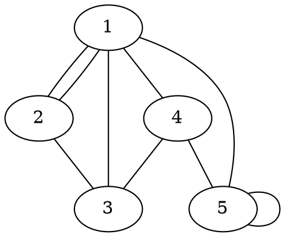

---

有向圖

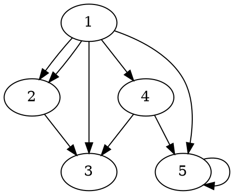

---

帶權圖

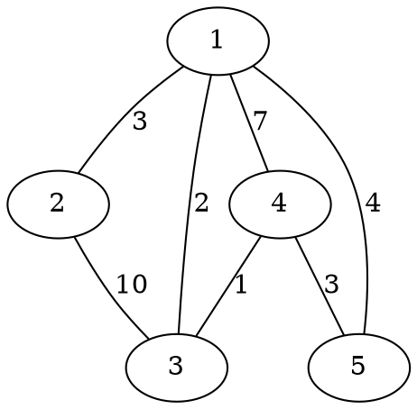

---

帶權有向圖

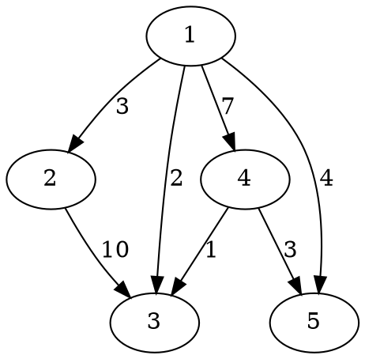

---

重邊

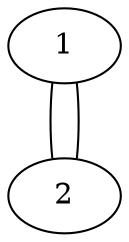

---

自環

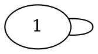

---

簡單圖，不含自環與重邊的圖

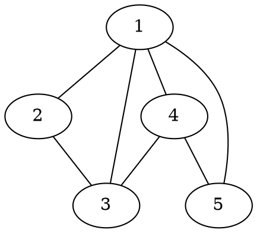

---

相鄰，$u$、$v$之間有邊相連

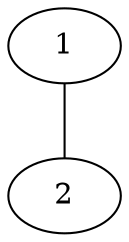

---

度數，一個點連出的邊的數量

|  點  | 1   | 2   |  3  | 4   |  5  |
|:----:| --- | --- |:---:| --- |:---:|
| 度數 | 4   | 2   |  3  | 3   |  2  |


---

入度：一個點連「進來」的邊數
出度：一個點連「出去」的邊數

|  點  | 1   | 2   |  3  | 4   |  5  |
|:----:| --- | --- |:---:| --- |:---:|
| 入度 | 0   | 2   |  3  | 1   |  3  |
| 出度 | 5   | 1   |  0  | 2   |  1  |


---

路徑（path），$1\rightarrow 2\rightarrow 3\rightarrow 4\rightarrow 5$


---

環，一條從自己到自己的路徑

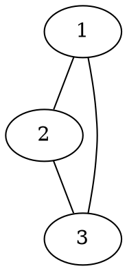

---

連通，$u$、$v$之間有路徑連通則稱其為連通
$1$、$2$連通；$1$、$4$不連通

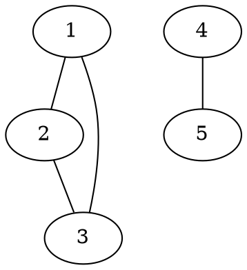

---

## 圖的表示法

---

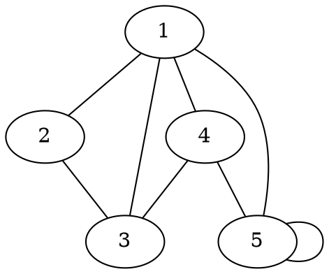

---

相鄰矩陣，$1$代表有邊、$0$代表沒邊相連

|     | 1   | 2   | 3   |  4  |  5  |
| --- | --- | --- | --- |:---:|:---:|
| 1   | 0   | 1   | 1   |  1  |  1  |
| 2   | 1   | 0   | 1   |  0  |  0  |
| 3   | 1   | 1   | 0   |  1  |  0  |
| 4   | 1   | 0   | 1   |  0  |  1  |
| 5   | 1   | 0   | 0   |  1  |  1  |

---

鄰接串列，對每個點存與其相鄰的點
實作時可以使用vector

|         |     |     |     |     |
|:-------:| --- |:---:|:---:| --- |
| ++1++： | 2   |  3  |  4  | 5   |
| ++2++： | 1   |  3  |     |     |
| ++3++： | 1   |  2  |  4  |     |
| ++4++： | 1   |  3  |  5  |     |
| ++5++： | 1   |  4  |  5  |     |

---

帶權圖

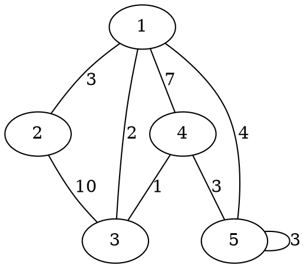

---

相鄰矩陣，值代表兩點之間的邊的權重

|     | 1   |  2  | 3   |  4  |  5  |
| --- | --- |:---:| --- |:---:|:---:|
| 1   | INF |  3  | 2   |  7  |  4  |
| 2   | 3   | INF | 10  | INF | INF |
| 3   | 2   | 10  | INF |  1  | INF |
| 4   | 7   | INF | 1   | INF |  3  |
| 5   | 4   | INF | INF |  3  |  3  |

---

如果有重邊怎麼辦？

---

鄰接串列，使用pair來儲存邊的資訊
（連到的點，邊的權重）

|         |        |         |        |        |
|:-------:| ------ |:-------:|:------:| ------ |
| ++1++： | (2, 3) | (3, 2)  | (4, 7) | (5, 4) |
| ++2++： | (1, 3) | (3, 10) |        |        |
| ++3++： | (1, 2) | (2, 10) | (4, 1) |        |
| ++4++： | (1, 7) | (3, 1)  | (5, 3) |        |
| ++5++： | (1, 4) | (4, 3)  | (5, 3) |        |

---

相鄰矩陣
```cpp=
#include <bits/stdc++.h>
using namespace std;

const int INF = 1000000009;
int n, m;
int G[2009][2009];
int main() {
    cin >> n >> m;
    // 先將所有格子都初始化為無限大，這裡在影片中漏掉了QQ
    for (int i = 1; i <= n; ++ i) {
        for (int j = 1; j <= n; ++ j) {
            G[i][j] = INF;
        }
    }
    for (int i = 0; i < m; ++i) {
        int a, b, c;
        cin >> a >> b >> c;
        G[a][b] = c;
        //G[b][a] = c; 無向圖的話要加上這一行
        //可以想想看沒有邊權的情況是如何？
    }
}
```

---

鄰接串列

```cpp=
#include <bits/stdc++.h>
using namespace std;
int n, m;
vector<pair<int, int>> v[1000009];
int main() {
    cin >> n >> m;
    for (int i = 0; i < m; ++i) {
        int a, b, c;
        cin >> a >> b >> c;
        v[a].push_back({b, c});
        //v[b].push_back({a, c}); 無向圖的時候要加上這一行
    }
}
```

---

相鄰矩陣所需的空間為$O(V^2)$，因此大多只適用於$V\leq 5000$的情況。
在資訊競賽中，大多數情況下會使用鄰接串列。

---

## 圖的遍歷

---

深度優先搜索DFS

* 一直往下走，無路可走的時候就回頭
* 走過的路不重複走

---

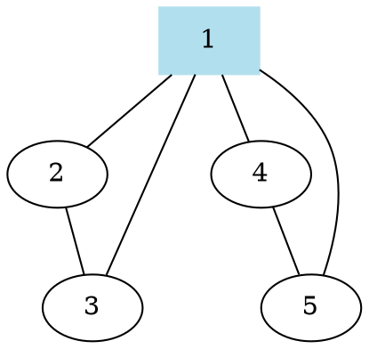

---

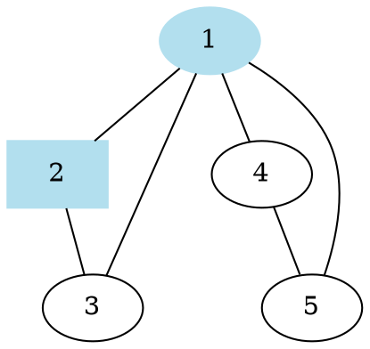

---

無路可走了，往回走。

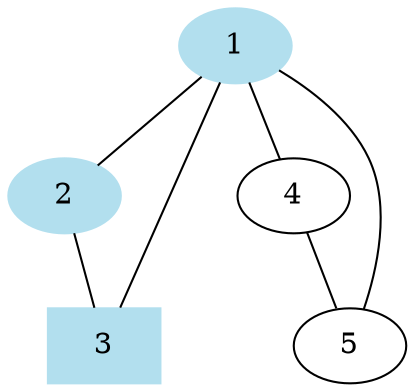

---

無路可走了，往回走。


---

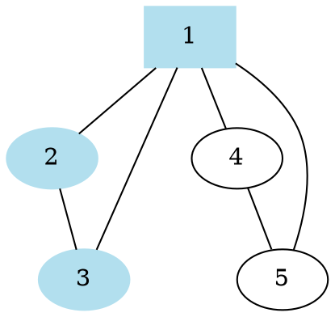

---

```graphviz
graph{
    "1" -- "2"
    "1" -- "3"
    "2" -- "3"
    "1" -- "4"
    "4" -- "5"
    "1" -- "5"
    "1", "2", "3", "4" [color = "lightblue2", style = "filled"]
    "4" [shape = "box"]
}
```

---

無路可走了，往回走。

```graphviz
graph{
    "1" -- "2"
    "1" -- "3"
    "2" -- "3"
    "1" -- "4"
    "4" -- "5"
    "1" -- "5"
    "1", "2", "3", "4", "5" [color = "lightblue2", style = "filled"]
    "5" [shape = "box"]
}
```

---

無路可走了，往回走。

```graphviz
graph{
    "1" -- "2"
    "1" -- "3"
    "2" -- "3"
    "1" -- "4"
    "4" -- "5"
    "1" -- "5"
    "1", "2", "3", "4", "5" [color = "lightblue2", style = "filled"]
    "4" [shape = "box"]
}
```

---

無路可走了，結束。

```graphviz
graph{
    "1" -- "2"
    "1" -- "3"
    "2" -- "3"
    "1" -- "4"
    "4" -- "5"
    "1" -- "5"
    "1", "2", "3", "4", "5" [color = "lightblue2", style = "filled"]
    "1" [shape = "box"]
}
```

---

```cpp=
#include <bits/stdc++.h>
using namespace std;

bool visited[1000009];
vector<int> v[1000009];

void dfs(int u) {
    visited[u] = 1;
    // do something
    for (auto i : v[u]) 
        if (visited[i] == false)
            dfs(i);
}
```

---

DFS可以用來解決一些問題：

* 枚舉排列組合的可能
* 樹上最遠點對
* 窮舉數獨的解答
* ...etc

---

廣度優先搜索 BFS

* 往外走一格
* 重複上述步驟直到無路可走

---

```graphviz
graph{
    "1" -- "2"
    "1" -- "3"
    "2" -- "3"
    "2" -- "4"
    "2" -- "5"
    "3" -- "6"
    "4" -- "7"
    "5" -- "7"
    "1" [color = "lightblue2", style = "filled"]
}
```

---

```graphviz
graph{
    "1" -- "2"
    "1" -- "3"
    "2" -- "3"
    "2" -- "4"
    "2" -- "5"
    "3" -- "6"
    "4" -- "7"
    "5" -- "7"
    "1", "2", "3" [color = "lightblue2", style = "filled"]
}
```

---

```graphviz
graph{
    "1" -- "2"
    "1" -- "3"
    "2" -- "3"
    "2" -- "4"
    "2" -- "5"
    "3" -- "6"
    "4" -- "7"
    "5" -- "7"
    "1", "2", "3", "4", "5", "6" [color = "lightblue2", style = "filled"]
}
```

---

```graphviz
graph{
    "1" -- "2"
    "1" -- "3"
    "2" -- "3"
    "2" -- "4"
    "2" -- "5"
    "3" -- "6"
    "4" -- "7"
    "5" -- "7"
    "1", "2", "3", "4", "5", "6", "7" [color = "lightblue2", style = "filled"]
}
```

---

```cpp=
#include <bits/stdc++.h>
using namespace std;

bool visited[1000009];
vector<int> v[1000009];
queue<int> q;

int main() {
    q.push(1); //假設1為起點
    while (q.size()) {
        int u = q.front();
        // do something
        q.pop();
        for (auto i : v[u]) 
        if (visited[i] == false) {
            visited[i] = 1;
            q.push(i);
        }
    }
}
```

---

BFS可以用來解決一些問題：

* 不帶權圖的最短路徑問題
* ...etc

---

BFS和DFS中
每個點、邊只會被遍歷到一次
因此複雜度為$O(E+V)$