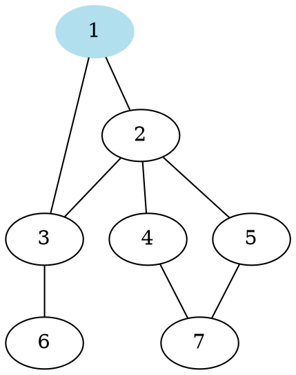
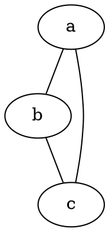
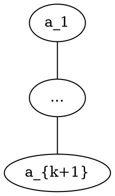
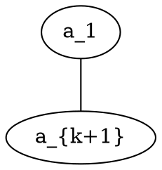
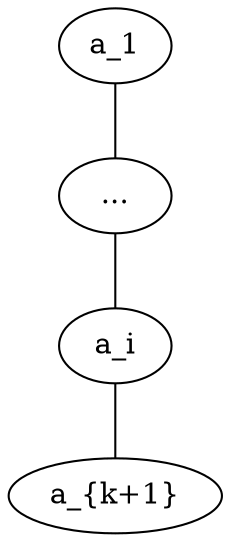
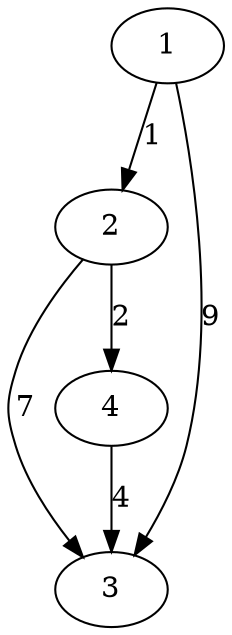
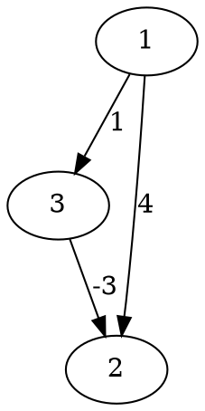
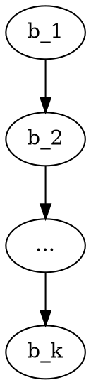
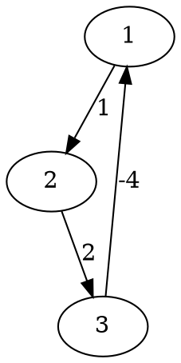
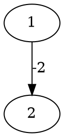

# 圖論 - 2

---

## 最短路徑問題

---

一張圖上若兩點不連通，則定義其距離為無限大；
反之則定義為所有路徑中，邊權和最小的那一個，也就是最短路徑。

---

### BFS

* 所有邊的邊權都一樣
* 先被放進queue的比後放進去的，離起點更近
* 因此BFS就可以解決了

---



---

複雜度$O(V+E)$

---

### 鬆弛

最短路徑問題的核心概念，稱之為鬆弛：
若$a$到$b$的距離大於$a$到$c$再從$c$到$b$的距離，則將其更新為較小值。

---

$$
d[a][b] = min(d[a][b], d[a][c]+d[c][b])
$$



---

假設所有邊的權重都大於等於零。
假設離起點第$i$近的點為$a_i$，起點是$a_1$。

---

從$a_1$到$a_{k+1}$的最短路徑
（這裡在影片中誤打成$k$了）



---

要嘛是直接從$a_1$到$a_{k+1}$
要嘛是先走到某個$a_i$，$2\leq i \leq k$，再到$a_{k+1}$





---

因此我們會有以下的式子
而這條式子也保證了貪心法的正確性

$$
dis(a_1, a_{k+1}) = \displaystyle\min_{i=1}^{k} \left( dis(a_1, a_i) + edge(a_i, a_{k+1}) \right)
$$

---

## Dijkstra

* 單點源最短路徑演算法
* 貪心法
* 求出離起點第$1,2,\cdots ,k$近的點
* 用其求出離起點第$k+1$近的點，以此類推

---

注意：
以上所說的性質只成立於沒有負邊的情況
邊的權重若可小於零
則可能出現$a_1$到$a_{k+1}$的最短路徑上
需要用到$a_j$但$j>k+1$的情況
因此無法使用Dijkstra演算法

---

| 點   | 1   | 2   | 3   |  4  |
| ---- | --- | --- | --- |:---:|
| 距離 | 0   | INF | INF | INF |




---

用$1$去鬆弛其他點

| 點   | ++1++ | 2   |  3  |  4  |
| ---- |:-----:| --- |:---:|:---:|
| 距離 |   0   | 1   |  9  | INF |


---

用$2$去鬆弛其他點

| 點   | ++1++ | ++2++ |  3  |  4  |
| ---- | ----- |:-----:|:---:|:---:|
| 距離 | 0     |   1   |  8  |  3  |


---

用$4$去鬆弛其他點

| 點   | ++1++ | ++2++ |  3  | ++4++ |
| ---- | ----- | ----- |:---:|:-----:|
| 距離 | 0     | 1     |  7  |   3   |


---

用$3$去鬆弛其他點

| 點   | ++1++ | ++2++ | ++3++ | ++4++ |
| ---- | ----- | ----- |:-----:|:-----:|
| 距離 | 0     | 1     |   7   |   3   |


---

```cpp=
int n;
vector<pair<int, int>> v[1000009];
int d[1000009];
bool vis[1000009];

void Dijkstra() {
    fill(d + 1, d + n + 1, INF);
    fill(vis + 1, vis + n + 1, false);
    d[1] = 0;
    
    // 在影片中這裡有vis[1] = true;
    // 是錯誤的寫法
    // 否則在for迴圈中，由於vis[1]是true了，mn就不會是1
    // 因此就會造成無法使用1去鬆弛其他所有點的情況
    // 而在下個投影片中的V-1也要修改成V
    
    while (1) {
        // 若是所有點都已經被算過了，則break
        bool ok = true;
        for (int i = 1; i <= n; ++ i)
            ok &= (vis[i] == true);
        if (ok)
            break;
        
        // 找到vis == false且離起點最近的點
        int mn = -1;
        for (int i = 1; i <= n; ++ i) {
            if (vis[i] == true)
                continue;
            if (mn == -1 || (d[i] < d[mn]))
                mn = i;
        }
        
        // 鬆弛其他所有的點
        vis[mn] = 1;
        for (auto i : v[mn])
            d[i.first] = min(d[i.first], d[mn] + i.second);
    }
}
```

---

在一次迴圈中，會有一個點的$vis$值被設為$1$
因此，總共需要$V$次迴圈
另外，在每次迴圈中，找到$mn$所需的時間為$O(V)$
而鬆弛的複雜度為$O(deg(mn))$
（一條邊會被用來鬆弛兩次）
因此總複雜度為：$O(V^2 + E) = O(V^2)$

---

```cpp=
using pii = pair<int, int>;
int n, m;
vector<pii> v[1000009];
set<pii> s;
int d[1000009];

void dijkstra() { // 假設起點為1
    d[1] = 0;
    for (int i = 2; i <= n; ++ i) d[i] = 1e9;
    for (int i = 1; i <= n; ++ i) s.insert({d[i], i});

    while ((int)s.size()) {
        // 將尚未取出的點中，距離遠點最近的取出來
        auto u = *s.begin();
        s.erase(s.begin());

        // 鬆弛其他點
        for (auto i : v[u.second]) {
            if (d[i.first] > u.first + i.second) {
                // 維護好每個點在set內的值
                s.erase({d[i.first], i.first});
                d[i.first] = u.first + i.second;
                s.insert({d[i.first], i.first});
            }
        }
    }
}
```

---

set中最多有$V$個元素
每個點都會被取出一次，共$O(V\log(V))$
每次的鬆弛可能會導致一次insert、一次erase
共有$O(E)$次鬆弛
因此總複雜度為：$O((V+E)\log(V))$

---

因為在競賽中，通常$V \approx E$
因此這種版本的寫法比較通用
不過還有再簡化的以下版本，但常數較大

---

```cpp=
using pii = pair<int, int>;
int n, m;
vector<pii> v[1000009];
priority_queue<pii, vector<pii>, greater<pii> > pq;
int d[1000009];

void dijkstra() { // 假設起點為1
    d[1] = 0;
    for (int i = 2; i <= n; ++i) d[i] = 1e9;
    pq.push(mk(d[1], 1)); // (距離, 點)

    while (pq.size()) {
        auto u = pq.top();
        pq.pop();
        if (d[u.second] < u.first) continue;

        for (auto i : v[u.second]) {
            if (d[i.first] > u.first + i.second) {
                d[i.first] = u.first + i.second;
                pq.push(make_pair(d[i.first], i.first));
            }
        }
    }
}
```

---

## Bellman-Ford

---

Bellman-Ford演算法也是單點源的
可以處理邊有負邊的情況
每次檢查所有邊是否可以被鬆弛
若沒有邊能鬆弛的話，則代表找到了所有最短路徑

---

| 點   | 1   | 2   |  3  |
| ---- | --- | --- |:---:|
| 距離 | 0   | INF | INF |




---

分別用(1, 2)、(1, 3)、(3, 2)的順序更新。

| 點   | 1   | 2   |  3  |
| ---- | --- | --- |:---:|
| 距離 | 0   | 4   |  1  |


---

已經無法再鬆弛了，因此結束。

| 點   | 1   |  2  |  3  |
| ---- | --- |:---:|:---:|
| 距離 | 0   | -2  |  1  |


---

```cpp=
int n, m;
vector<pair<int, int>> v[1000009];
int d[1000009];
void Bellman_Ford() {
    d[1] = 0;
    fill(d + 2, d + n + 1, INF);
    
    while (true) {
        bool ok = true;
        for (int i = 1; i <= n; ++ i) {
            for (auto j : v[i]) {
                if (d[i] + j.second < d[j.first]) {
                    ok = false;
                    d[j.first] = d[i] + j.second;
                }
            }
        }
        if (ok == true) break;
    }
}
```

---

若有一條最短路徑如下：



---

跑了迴圈$0$次時可以確定到$b_1$的最短距離
跑了迴圈$1$次時可以確定到$b_2$的最短距離
...
跑了迴圈$k-1$次時可以確定到$b_k$的最短距離

---

因為任何一條「最短路徑」至多由$V$個點組成
因此至多只會需要跑$V-1$次迴圈即可

---

每次迴圈要花$O(E)$的時間去鬆弛
因此總時間複雜度為$O(VE)$

---

反過來說，若是跑迴圈第$V$次時
依然可以鬆弛的話，就代表圖有負環存在

---

| 點   | 1   | 2   |  3  |
| ---- | --- | --- |:---:|
| 距離 | 0   | INF | INF |




---

第一次鬆弛

| 點   | 1   |  2  |  3  |
| ---- | --- |:---:|:---:|
| 距離 | 0   |  1  | INF |


---

第二次鬆弛

| 點   | 1   |  2  |  3  |
| ---- | --- |:---:|:---:|
| 距離 | 0   |  1  |  3  |


---

第三次鬆弛，還可以鬆弛
因此有負環存在

| 點   | 1   |  2  |  3  |
| ---- | --- |:---:|:---:|
| 距離 | -1  |  1  |  3  |


---

影片中提到的，距離為負
但沒有負環存在的情況

| 點   | 1   |  2  |
| ---- | --- |:---:|
| 距離 | 0   | -2  |




---

```cpp=
int n, m;
vector<pair<int, int>> v[1000009];
int d[1000009];
bool Bellman_Ford_Detect_Negative_Cycle() {
    d[1] = 0;
    fill(d + 2, d + n + 1, INF);
    int cnt = 0;
    
    while (cnt < n) {
        bool ok = true;
        for (int i = 1; i <= n; ++ i) {
            for (auto j : v[i]) {
                if (d[i] + j.second < d[j.first]) {
                    ok = false;
                    d[j.first] = d[i] + j.second;
                }
            }
        }
        if (ok == true) break;
        cnt += 1;
    }
    
    if (cnt == n) return true;
    else return false;
}
```

---

## Floyd-Warshall

---

看起來很像DP。

$$
d[a][b] = min(d[a][b], d[a][k]+d[k][b])
$$

---

看起來很更像DP。

$$
dp[a][b] = min(dp[a][b], dp[a][k]+dp[k][b])
$$

---

定義$dp[k][a][b]$為
使用$1,2,\cdots,k$為中間點鬆弛過後
$a,b$之間的最短距離

---

則可以得到以下轉移式

$$
dp[k][a][b] = min(\\
dp[k - 1][a][b], \\
dp[k - 1][a][k] + dp[k - 1][k][b])
$$

---

將第一維滾動

$$
dp[a][b] = min(dp[a][b], dp[a][k] + dp[k][b])
$$

---

```cpp=
int dp[N][N];

void FloydWarshall() {
    for (int i = 1; i <= n; ++ i)
        for (int j = 1; j <= n; ++ j)
            dp[i][j] = INF;
    
    for (int i = 1; i <= m; ++ i) {
        int a, b, c;
        cin >> a >> b >> c;
        dp[a][b] = min(dp[a][b], c); // 假設是有向圖
    }
    
    for (int k = 1; k <= n; ++k)
        for (int i = 1; i <= n; ++i)
            for (int j = 1; j <= n; ++j)
                dp[i][j] = min(dp[i][j], dp[i][k] + dp[k][j]);
}
```

---

* 全點對最短距離
* 時間複雜度$O(V^3)$
* 初始化時，使用到了鄰接矩陣