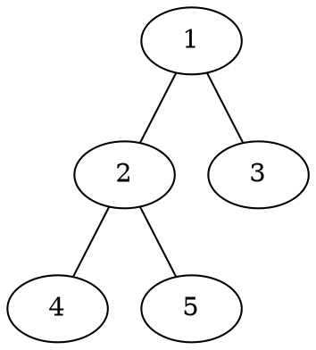
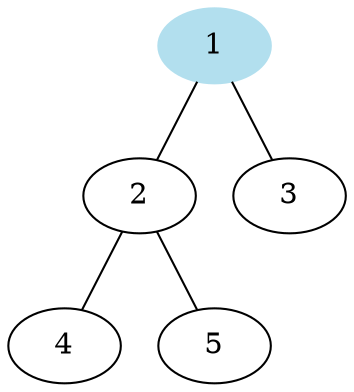
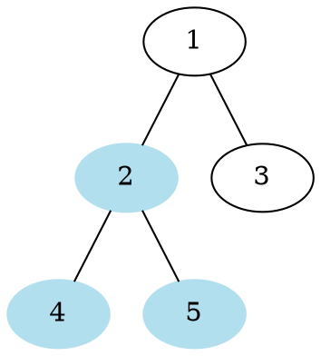
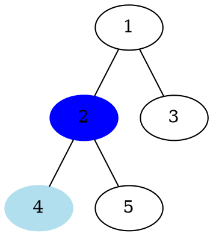
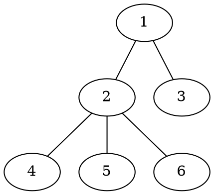
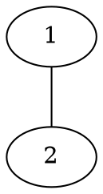
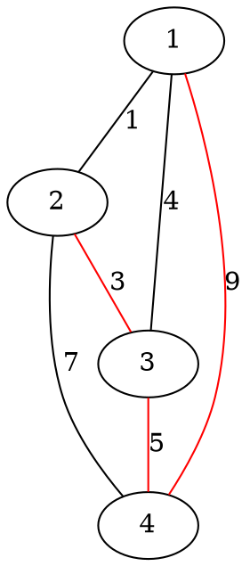
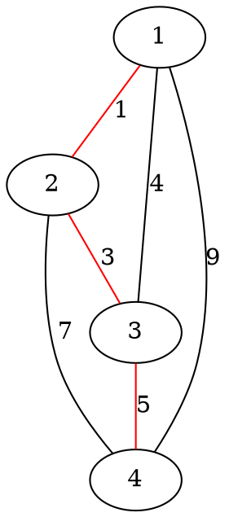
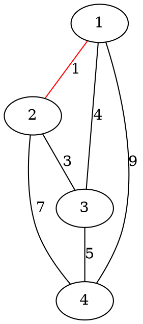
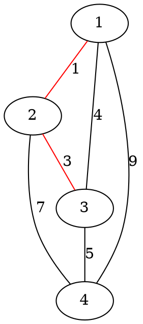

# 圖論 - 3

---

## 樹

---

* 沒有環的連通圖
* V = E + 1



---

根：樹的起點，最上面那個點



---

子樹：以某個節點為根所生成的樹



---

父節點、子節點



---

層數

| 點   | 1   | 2   | 3   | 4   |  5  |
| ---- | --- | --- | --- | --- |:---:|
| 層數 | 0   | 1   | 1   | 2   |  2  |


---

二元樹，所有節點至多只有兩個子節點


---

非二元樹



---

一些性質

* V = E + 1
* 樹上無環，但加上任一條邊都會出現環
* 樹連通，且任何一條邊被拿掉都會變不連通
* 任兩點只存在唯一一條簡單路徑

---

## 遍歷二元樹

---

* 前序：先走根，再走左子樹，最後走右子樹
* 中序：先走左子樹，再走根，最後走右子樹
* 後序：先走左子樹，再走右子樹，最後走根
* 層次：由上到下、由左到右遍歷 （BFS）

---

前序走訪

1，2，4，5，3


---

中序走訪

4，2，5，1，3


---

後序走訪

4，5，2，3，1


---

層次走訪

1，2，3，4，5


---

同時有前序、中序，或中序、後序的話
就能夠確定這棵二元樹的結構

---

只有前序、後序的話，則可能不行

前序：1，2
後序：2，1
2是左節點還是右節點？



---

## 最小生成樹

---

生成樹為一棵包含圖上所有點的樹
最小生成樹為權重和最小的生成樹

---

生成樹，權重和$17$



---

最小生成樹，權重和$9$



---

Kruskal演算法

* 貪心法
* 從邊權最小的邊檢查
* 可以加進生成樹就加進去
* 否則就略過這條邊

---



---



---

將$(1, 3)$加進生成樹的話會形成環，不行


---


---

將$(2, 4)$加進生成樹的話會形成環，不行


---

將$(1, 4)$加進生成樹的話會形成環，不行


---

最小生成樹的權重為$9$

```graphviz
graph{
    "1" -- "2" [label = "1", color = "red"]
    "1" -- "3" [label = "4"]
    "2" -- "4" [label = "7"]
    "3" -- "4" [label = "5", color = "red"]
    "2" -- "3" [label = "3", color = "red"]
    "1" -- "4" [label = "9"]
}
```

---

```cpp=
#include <bits/stdc++.h>
#define F first
#define S second
using namespace std;

typedef pair<int, int> pii;

int n, m, ans;
vector<pair<int, pii> > G;

//省略Disjoint set

int main() { 
    cin >> n >> m;
    for (int i = 1; i <= m; ++i) {
        int a, b, w;
        cin >> a >> b >> w;
        G.push_back({w, {a, b}});
    }

    sort(G.begin(), G.end());
    for (auto i:G) if (!same(i.S.F, i.S.S)) {
        unite(i.S.F, i.S.S);
        ans += i.F;
    }
}
```

---

* 排序所有邊需要$O(E\log(E))$
* 檢查一次邊需要$O(\alpha(E))$，共需要$O(E\alpha(E))$
* 總複雜度為：$O(E\log(E))$

---

Prim

* 和Dijkstra很像
* Dijkstra是維護到起點的距離
* Prim是維護到生成樹上任一點的最短距離

---

```cpp=
#include <bits/stdc++.h>
using namespace std;

typedef pair<int, int> pii

int n, m;
bool visited[1000009];
vector<pii> v[1000009];
priority_queue<pii, greater<pii>, greater<pii> > pq;

int prim() {
    int ans = 0;
    visited[1] = 1;
    pq.push(make_pair(0, 1));
    while (pq.size()) {
        pii u = pq.top();
        pq.pop();
        if (visited[u.second]) continue;
        visited[u.second] = 1;
        ans += u.first;
        for (auto i : v[u.second])
            if (visisted[i.first] == false)
                pq.push(i.second, i.first);
    }
    return ans;
}
```

---

另外也有$O(V^2)$版本的Prim

```cpp=

int n, m;
vector<pair<int, int>> v[1000009];
bool vis[1000009];
int d[1000009];

int prim() {
    int ans = 0;
    d[1] = 0;
    for (int i = 2; i <= n; ++ i) d[i] = INF;
    
    while (true) {
        bool ok = true;
        for (int i = 1; i <= n; ++ i)
            ok &= (vis[i] == true);
        if (ok) break;
        
        int mn = -1;
        for (int i = 1; i <= n; ++ i) {
            if (vis[i] == true) continue;
            if (mn == -1 || d[i] < d[mn])
                mn = i;
        }
        
        vis[mn] = true;
        ans += d[mn];
        for (auto i : d[mn])
            d[i.first] = min(d[i.first], i.second);
    }
    return ans;
}
```

---

在比賽中，Kruskal出場的機會遠比Prim大多了
究其原因，還是因為Kruskal實在太好寫了
不過偶爾還是會出現得用Prim才能解決的問題

---

## 二分圖

---

點可以分成兩種顏色
同個顏色之間沒有邊相連

```graphviz
graph{
    "1" -- "2"
    "1" -- "3"
    "2" -- "4"
    "3" -- "4"
    "4" -- "5"
    "1" -- "5"
    "1", "4" [color = "red", style = "filled"]
    "2", "3", "5" [color = "blue", style = "filled"]
}
```

---

判斷二分圖

* DFS 或 BFS

---

一個點是紅的，周圍的點就得是藍的
一個點是藍的，周圍的點就得是紅的
因此可以使用DFS判斷

```cpp=
#include<bits/stdc++.h>
using namespace std;

vector<int> v[1000009];
bool visited[1000009];
int col[1000009];

bool dfs(int x, int color) {
    bool isBip = 1;
    col[x] = color;
    visited[x] = 1;
    for (auto i : v[x]) {
        if (visited[i] && col[i] == col[x]) return false;
        if (!visited[i]) isBip &= dfs(i, color^1);
    }
    return isBip;
} 

int main() {
    int isBipartite = dfs(1, 1);
}
```

---

DFS整張圖一遍
複雜度為$O(V+E)$

---

## 拓撲排序

---

有向無環圖

```graphviz
digraph{
    "1" -> "2"
    "1" -> "3"
    "2" -> "4"
    "3" -> "4"
    "4" -> "5"
    "1" -> "5"
}
```

---

拓撲排序

使的所有排在後面的點
都不存在一條路徑
到達排在前面的點

---

(1, 3, 2, 4, 5)

```graphviz
digraph{
    "1" -> "2"
    "1" -> "3"
    "2" -> "4"
    "3" -> "4"
    "4" -> "5"
    "1" -> "5"
}
```

---

每次將入度為零的點取出來
直到整張圖為空為止

---

```graphviz
digraph{
    "1" -> "2"
    "1" -> "3"
    "2" -> "4"
    "3" -> "4"
    "4" -> "5"
    "1" -> "5"
}
```

---

(1)

```graphviz
digraph{
    "2" -> "4"
    "3" -> "4"
    "4" -> "5"
}
```

---

(1, 3)

```graphviz
digraph{
    "2" -> "4"
    "4" -> "5"
}
```

---

(1, 3, 2)

```graphviz
digraph{
    "4" -> "5"
}
```

---

(1, 3, 2, 4)

```graphviz
digraph{
    "5"
}
```

---

(1, 3, 2, 4, 5)

```graphviz
digraph{

}
```

---

```cpp=
int n, m, deg[1000009];
vector<int> v[1000009];

vector<int> TopologicalSort() {
    for (int i = 1; i <= n; ++ i) {
        for (auto j : v[i])
            deg[j] += 1;
    }
    
    queue<int> q;
    for (int i = 1; i <= n; ++i) {
        if (deg[i] == 0) 
            q.push(i);
    }
    
    vector<int> topo;
    while ((int)q.size()) {
        int p = q.front();
        q.pop();
        
        topo.push_back(p);

        for (auto i : v[p]) {
            deg[i] -= 1;
            if (deg[i] == 0)
                q.push(i);
        }
    }
    return t;
}
```

---

每個點至多被加入queue一次
被移出queue一次
而每條邊都會被刪除一次
因此複雜度為$O(V+E)$