# 並查集 Disjoint Set

## 概述

> 並查集是一個很重要的資料結構，在之後課程會講到的最小生成樹演算法中，扮演著舉足輕重的地位。

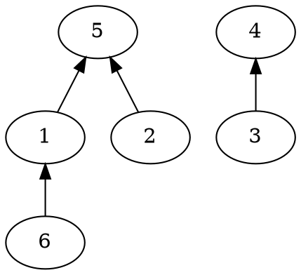

---

Disjoint Set又稱為並查集、互斥集，是具有以下功能的資料結構：

1. $Same(a, b)$：調查$a,b$是否存在同一個集合中
2. $Union(a, b)$：合併$a, b$所屬的兩個集合（也有可能$a,b$在同一個集合中）

---

遺憾的是，STL中並沒有現成的並查集可以使用。
不過並查集可以透過「維護每一個集合的根節點（最高的父親）」的技巧輕鬆的完成。

--- 

舉例來說

一開始所有數字都屬於各自的集合

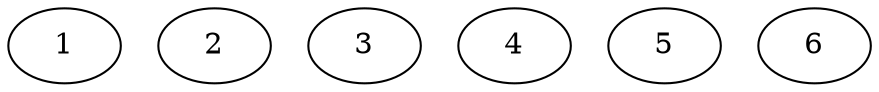

---

* $Union(5, 2)$

將$2$接在$5$的下面

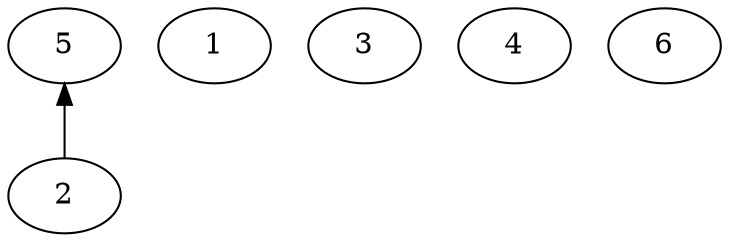

---

* $Union(1, 6)$

將$6$接在$1$的下面

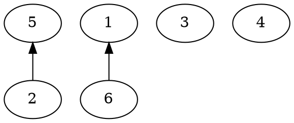

---


* $Union(2, 6)$

找到$2$和$6$所在的集合的根節點，$5、1$，再將$1$接在$5$的下面

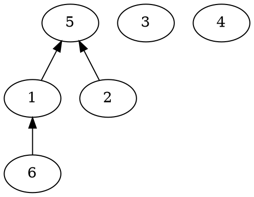

---

* $Same(6, 2)$

從$6$往上找到根節點、從$2$往上找到根節點，$5=5$，因此兩個數字在同個集合中

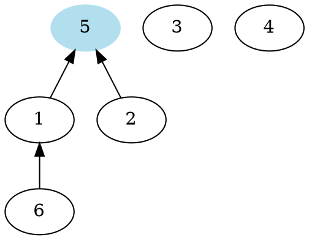

---

* $Union(4, 3)$

將$3$接在$4$的下面


---

* $Same(6, 3)$

從$6$往上找到根節點、從$3$往上找到根節點，$5 \neq 4$，因此兩個數字不在同個集合內

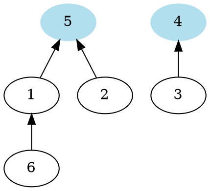

---

```cpp=
#include <bits/stdc++.h>
using namespace std;

vector<int> fa;
int find(int x) { //找到x所在的集合的根節點
    return (x == fa[x]) ? x : find(fa[x]);
}
void unite(int x, int y) {
    // 將 y 所在的樹的根節點，接在 x 所在的樹的根節點下面
    fa[find(y)] = find(x);
}

int main() {
    int n; cin >> n;
    fa.resize(n);
    // 初始化，將所有數字的父節點設為自己
    for (int i = 0; i < n; ++ i)
        fa[i] = i;
    
    int q; cin >> q;
    while ( q -- ) {
        int op; cin >> op;
        if (op == 1) {
            int x, y;
            cin >> x >> y;
            unite(x, y);
        } else {
            int x, y;
            cin >> x >> y;
            // 判斷 x 所在的集合與 y 所在的集合的根節點是否相同
            if (find(x) == find(y))
                cout << "Yes\n";
            else
                cout << "No\n";
        }
    }
}
```

---

然而，在最差的情況下，可能會遇到以下的狀況：
因為$Find$的複雜度是樹的高度，因此是$O(n)$，所以$Union$與$Same$的複雜度也會是$O(n)$，這樣的複雜度是很糟糕的。

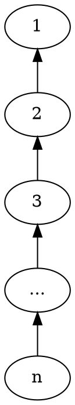

---

## 啟發式合併

啟發式合併是一種有效解決上述問題的方法。
其中心的思維是，在合併的時候，將比較小的樹接在比較大的樹下面。

---
舉例來說：

* $Union(6, 3)$

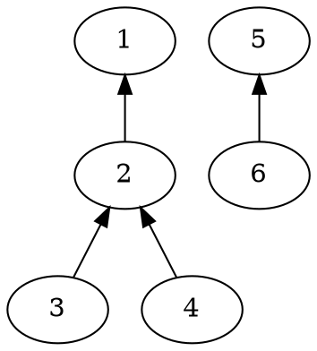

---

因為$6$所在的樹的大小為二，$3$所在的樹的大小為四。
要將小的樹接在大的樹下面，因此將$5$接在$1$的下面。

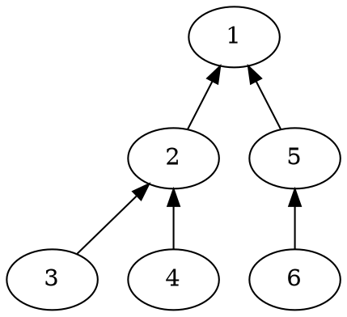

---

```cpp=
vector<int> fa;
vector<int> sz;
void init(int n) {
    fa.resize(n);
    sz.resize(n);
    for (int i = 0; i < n; ++ i) {
        fa[i] = i;
        sz[i] = 1; // 一開始樹的大小都是 1 
    }
}
int find(int x) {
    return x == fa[x] ? x : find(fa[x]);
}
void unite(int x, int y) {
    if (find(x) == find(y)) return; 
    if (sz[find(x)] < sz[find(y)])
        swap(x, y); // 將 x 換成比較大的那邊、y 換成比較小的
    sz[find(x)] += sz[find(y)]; // 記得更新合併後的樹的大小
    fa[find(y)] = find(x);
}
```

---

對於一個元素$x$，在每次合併中，會有兩種情況：


* $x$ 屬於比較大的樹中
    在這種情況下，$x$的深度不變
* $x$ 屬於比較小的樹中
    在這種情況下，$x$所在的樹的大小至少變為兩倍
    並且 $x$ 的深度增加一

舉例來說，在上面的圖中，$6$的深度原本是$2$，合併後增加了$1$變成$3$。
而$6$所在的樹的大小從$2$變成了$6$，而$6 \div 2 >= 2$。

---

$Find$的複雜度就是節點的深度。
合併時，第一種情況不會改變元素的深度。
在第二種情況時，因為樹的大小至少變為兩倍，因此最多只會發生$O(log(n))$次。
也就是說，一個元素的深度最多只會增加$O(log(n))$。
所以$Find$的複雜度也就是$O(log(n))$，同樣的$Same、Union$也是。

---

## 路徑壓縮

除了啟發式合併以外，還有一種方法可以加速。

舉例來說：

* $Find(6)$

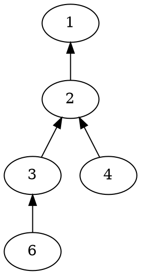

---

因為真正重要的就只有「樹的根節點」。
因此在經過$6、3$的時候，我們可以「順便」把它們移到$1$的下面。
而$4$之所以還沒有移過去，是因為我們還沒有用到它。

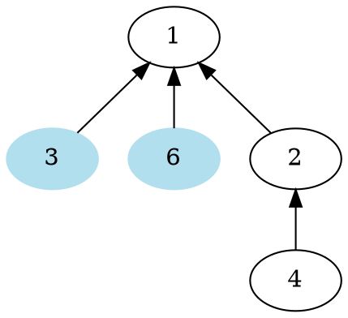

---

* $Find(4)$

在經過$4$的時候，「順便」將它移到$1$的下面。

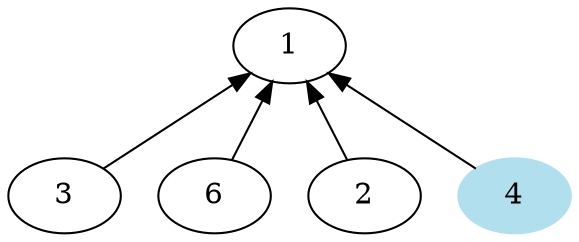

---

```cpp=
vector<int> fa;
vector<int> sz;
void init(int n) {
    fa.resize(n);
    sz.resize(n);
    for (int i = 0; i < n; ++ i) {
        fa[i] = i;
        sz[i] = 1; // 一開始樹的大小都是 1 
    }
}
int find(int x) {
    // 注意到後面那式變成了 fa[x] = find(fa[x])
    // 這樣一來，就可以直接將 fa[x] 變成根節點的值
    return x == fa[x] ? x : fa[x] = find(fa[x]);
}
void unite(int x, int y) {
    if (find(x) == find(y)) return; 
    if (sz[find(x)] < sz[find(y)])
        swap(x, y); // 將 x 換成比較大的那邊、y 換成比較小的
    fa[find(y)] = fa[find(x)];
    sz[find(x)] += sz[find(y)]; // 記得更新合併後的樹的大小
}
```

---

如果同時使用啟發式合併與路徑壓縮的話，$Find$的複雜度可以進一步降低為$\alpha(n)$。
$\alpha(n)$是阿克曼函數的反函數，舉例來說$\alpha(2^{2^{2^{2^2}}}) = 4$，是個增長速度非常慢的函數。

不過實際上，單單只使用路徑壓所的話，在大多數的情況下就已經夠快了，所以嫌麻煩的話可以不使用啟發式合併。

```cpp=
vector<int> fa;
int find(int x) {
    return x == fa[x] ? x : fa[x] = find(fa[x]);
}
void unite(int x, int y) {
    fa[find(y)] = find(x);
}
```
***

## 例題演練

### 家族

有$n$個數字$1,2,\cdots ,n$，一開始每個數字都在不同的集合中。
有$q \leq 10^5$筆操作，分別為以下兩種：

1. 給定$a, b$，$1\leq a, b\leq n$，將$a,b$所在的集合合併
2. 給定$a$，$1\leq a \leq n$，查詢$a$所在的集合中的最大值

---


第一個操作可以用並查集維護。
第二個操作的話，我們可以在合併時，將根節點比較大的當作根，以此來維護。

舉例來說：

* $Union(1, 4)$

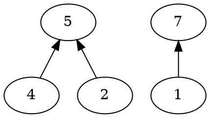

---

因為$1$所在的集合的根$7$，比$4$所在的集合的根$5$，還要大，因此將$5$接在$7$的下面。
如此一來，我們就可以維護好一棵樹中，根一定會是整棵樹的最大值。

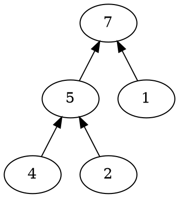

---

```cpp=
#include <bits/stdc++.h>
using namespace std;

vector<int> fa;
int find(int x) {
    return x == fa[x] ? x : fa[x] = find(fa[x]);
}
void unite(int x, int y) {
    if (find(x) < find(y)) 
        swap(x, y); // 將 x 換成find值較大的
    fa[find(y)] = find(x);
}

int main() {
    int n; cin >> n;
    fa.resize(n);
    iota(fa.begin(), fa.end(), 0);
    
    int q; cin >> q;
    while ( q -- ) {
        int op; cin >> op;
        if (op == 1) {
            int x, y;
            cin >> x >> y;
            unite(x, y);
        } else {
            int x; 
            cin >> x;
            cout << find(x) << "\n"; //根節點就會是集合中的最大值
        }
    }
}
```

---

## 總結

有許多圖論相關的題目會使用到並查集。