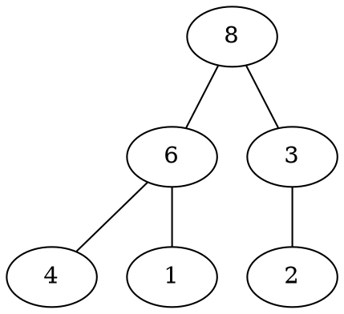
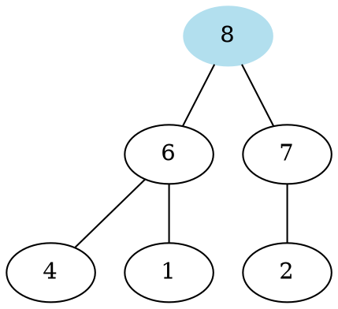
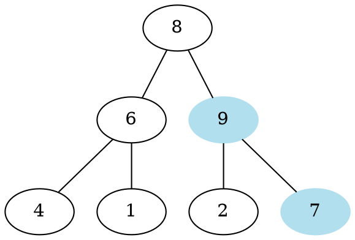
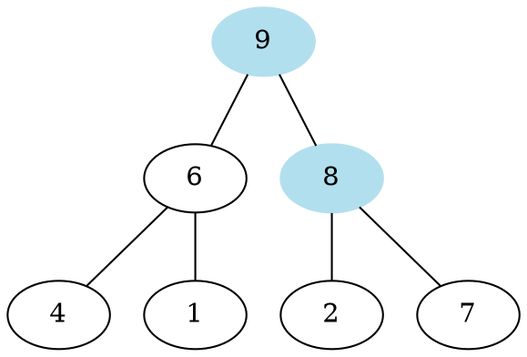
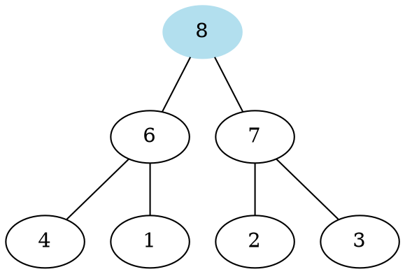
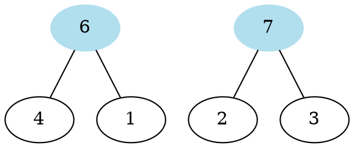
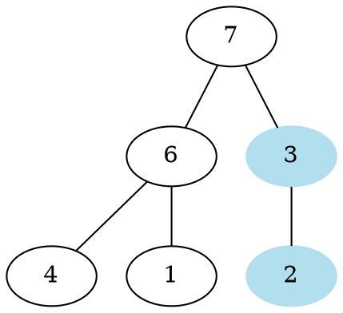

# Heap 堆積

> 演算法與資料結構是競賽程式中重要的兩個基石。好的資料結構可以降低coding的複雜度、抑或是提升演算法的效率。在本節課中，我們將會延續上堂課的內容，來介紹一些在競程中常用、不可或缺的資料結構：Heap、Disjoint Set、Segment Tree、Binary Indexed Tree。

## 動態集合最大值

考慮以下問題：

***
給定一個集合$S$，一開始$S=\emptyset$，支援以下三種操作：
1. 查詢$S$中的最大值
2. 將$S$中的最大值移除
3. 給一個數字$x$，將$x$加入$S$中

保證操作次數$\leq 1e5$、$|x|\leq1e18$，並且在第一、二個操作時$S$不為空
***

一個樸素的作法是使用vector。
對於第一個操作，就跑遍vector裡所有的元素去檢查。
對於第二個操作，也是檢查過所有元素，移除最小值後，再將後面的數字全部往前一格
對於第三個操作，直接將$x$放到vector裡。

然而，我們使用第一天教到的複雜度來分析的話可以知道：
* 第一個操作的複雜度為$O(q)$
* 第二個操作的複雜度為$O(q)$
* 第三個操作的複雜度為$O(1)$

總共有$q$筆操作，因此總複雜度為$O(q^2)$，無法在時限內跑完。

## 概述



***

Heap是一種特殊的二元樹，具有以下的性質：
1. 除了最後一層以外，都是滿的
2. 父節點的值大於子節點的值

因為有第一項的性質，可以發現這棵樹的高度為$O(log(n))$，其中$n$是節點的數量
***

Heap能夠有效率的完成以下這些操作：

### 查詢最大值
* 其實也就是根節點



很明顯的，這個操作的複雜度為$O(1)$。

***

### 插入一個新的數字
* 先將數字放到最下層的最左邊
* 若比父節點還要大的話，則將其與父節點交換
* 直到比父節點小、或是成為根節點為止






在最糟糕的情況下，節點會一直從葉子交換到根節點
因此這個操作的複雜度為樹的高度，也就是$O(log(n))$

***

### 刪除最大值

* 先將根節點移除
* 看看左、右子節點，將比較大的搬上來當作新的根節點
* 往那邊的子樹進行遞迴

移除$8$


比較$6$和$7$的大小


將較大者當作新的根，並往那邊的子樹遞迴
$3$、$2$中取大的當作右子樹的根節點



(並不是「每一層」都是滿的，而是除了最後一層以外都是滿的)

也就是說，我們先移除根節點
接著將第二層中其中一個節點搬上來替補
再將第三層中其中一個節點搬上來替補
...以此類推

因此這個操作的複雜度也是樹的高度，$O(log(n))$

***

### 複雜度

| 查詢最大值 | 加入新數字  | 移除最大值  |
| ---------- | ----------- | ----------- |
| $O(1)$     | $O(log(n))$ | $O(log(n))$ |

***

## Priority Queue

在STL中，已經提供了Heap的資料結構，其名為Priority Queue
因此我們並不需要自己實作

使用範例如下：

```cpp=
#include <bits/stdc++.h>
using namespace std;

int main() {
    priority_queue<int> pq; // 宣告一個Heap
    pq.push(7); // 加入數字
    pq.push(1);
    pq.push(2);
    if ((int)pq.size() != 0) // 檢查目前pq是否為空
        pq.pop(); // 移除最大值
    cout << pq.top() << "\n"; // 最大值
}
// 2
```

在上述中，我們介紹的Heap的根節點是所有數字中的最大值
如果我們需要維護一個最小值的Heap的話，可以這樣寫：

```cpp=
#include <bits/stdc++.h>
using namespace std;

int main() {
    // 宣告一個Heap，根節點為最小值
    priority_queue<int, vector<int>, greater<int>> pq; 
    pq.push(7); // 加入數字
    pq.push(1);
    cout << pq.top() << "\n"; // 最小值
}
// 1
```

***

現在，我們來回顧一下開頭所講的題目：


給定一個集合$S$，一開始$S=\emptyset$，支援以下三種操作：
1. 查詢$S$中的最小值
2. 將$S$中的最小值移除
3. 給一個數字$x$，將$x$加入$S$中

保證操作次數$\leq 1e5$、$|x|\leq1e18$，並且在第一、二個操作時$S$不為空
***

如果使用Heap來維護$S$的話，第一個操作的複雜度為$O(1)$
第二個操作的複雜度為$O(log(q))$
第三個操作的複雜度為$O(log(q))$
因此，總共的時間複雜度為$O(qlog(q))$，可以滿足時間限制

```cpp=
#include <bits/stdc++.h>
using namespace std;
typedef long long ll; // 定義縮寫，long long太長了

int main() {
    priority_queue<ll, vector<ll>, greater<ll>> pq;
    int q; cin >> q;
    while ( q -- ) {
        int op; cin >> op;
        if (op == 1) {
            cout << pq.top() << "\n";
        } else if (op == 2) {
            pq.pop();
        } else {
            ll x; cin >> x;
            pq.push(x);
        }
    }
}
```

***

## 例題演練

### 中位數

給定一個集合$S$，一開始$S=\emptyset$
共有$q \leq 10^5$筆操作，操作分為以下兩種：
1. 給定一個數字$x$，$|x|\leq 10^9$，將$x$加入$S$中
2. 詢問$S$內的中位數是多少

保證在第二個詢問時$S$不為空。
***

如果每次加入一個數字後，就將$S$中的數字重新排序肯定會TLE。
然而透過Priority Queue的合理運用，不僅是最大、最小的數字，我們甚至能維護一個找到第$K$大的元素的資料結構。

具體做法如下：

1. 將資料分成：大於中位數的部分、小於等於中位數的部分
2. 使用兩個Priority Queue分別維護兩邊的資料
3. 插入元素時維護好兩邊Priority Queue的大小

***
舉例來說：

insert 5
小於等於中位數：5
大於中位數　　：

***

insert 3
小於等於中位數：3、5
大於中位數　　：

調整兩邊的大小
小於等於中位數：3
大於中位數　　：5

***

insert 9
小於等於中位數：3
大於中位數　　：5、9

調整兩邊的大小
小於等於中位數：3、5
大於中位數　　：9

***

insert 4
小於等於中位數：3、4、5
大於中位數　　：9

調整兩邊的大小
小於等於中位數：3、4
大於中位數　　：5、9

***

```cpp=
#include <bits/stdc++.h>
using namespace std;

int main() {
    priority_queue<int, vector<int>, greater<int>> Mh; //大於中位數的
    priority_queue<int> mh; // 小於等於中位數的
    
    int q; cin >> q;
    while ( q -- ) {
        int op; cin >> op;
        if (op == 1) {
            int x; cin >> x;
            // 根據 x 的大小決定 x 要放在哪個Priority Queue中
            if (mh.empty() || mh.top() > x)
                mh.push(x);
            else 
                Mh.push(x);
            // 保持兩個Priority Queue之間的大小
            if ((int)mh.size() > (int)Mh.size() + 1) {
                Mh.push(mh.top());
                mh.pop();
            } else if ((int)mh.size() + 1 < (int)Mh.size()) {
                mh.push(Mh.top());
                Mh.pop();
            }
        } else {
            // 根據兩個Priority Queue的大小來決定中位數是甚麼
            if ((int)mh.size() == (int)Mh.size())
                cout << (double)(mh.top() + Mh.top())/2.0 << "\n";
            else if ((int)mh.size() > (int)Mh.size())
                cout << mh.top() << "\n";
            else
                cout << Mh.top() << "\n";
        }
    }
}
```

要注意的是，在TIOJ中的這題，因為測資過大，因此要使用輸入輸出優化。

***

### 好數對

給定兩個長度為$n \leq 10^5$的數列$a_i, b_i (0\leq i\leq n-1)$，對一個數對$(x, y)$我們定義它的好度為$a_x+b_y$，請求出在所有數對中，好度第$k$小的值是多少。

***

一個暴力的作法是將所有$a_x+b_y$的數對都放進Priority Queue內，再依序取出$k$個數字，但這樣的做法肯定會TLE。

---


如果我們先將$a_i, b_i$由小到大排序的話，則$a_0+b_0$肯定是最小。

更進一步可以發現，對於任意$x,y$，$y\geq 1$，我們有$a_x+b_{y-1} \leq a_x+b_{y}$，也就是說，若是$(x,y)$還沒被取到的話，$(x,y+1)$就不可能被取到。

由此我們可以想出以下作法：

1. 將${a_i}、{b_i}$排序
2. 將$(0, 0), (1,0),\cdots,(n-1,0)$放入Priority Queue中
3. 每次把Priority Queue中，$a_x+b_y$最小的數字取出來，假設取出來的是$(x,y)$
4. 將$(x,y+1)$放進Priority 

***

舉例來說，$a = \{3, 9, 15\}, b = \{1, 5, 10\}，k = 5$

|     | 1   | 5   | 10  |
| --- | --- | --- |:---:|
| 3   | 4   | 8   | 13  |
| 9   | 10  | 14  | 19  |
| 15  | 16  | 20  | 25  |

pq = {4, 10, 16}
取出的數：
***

|     |  1  | 5   | 10  |
| --- |:---:| --- |:---:|
| 3   |     | 8   | 13  |
| 9   | 10  | 14  | 19  |
| 15  | 16  | 20  | 25  |

pq = {8, 10, 16}
取出的數：4
***

|     | 1   |  5  | 10  |
| --- | --- |:---:|:---:|
| 3   |     |     | 13  |
| 9   | 10  | 14  | 19  |
| 15  | 16  | 20  | 25  |

pq = {10, 13, 16}
取出的數：4, 8
***

|     | 1   |  5  | 10  |
| --- | --- |:---:|:---:|
| 3   |     |     | 13  |
| 9   |     | 14  | 19  |
| 15  | 16  | 20  | 25  |

pq = {13, 14, 16}
取出的數：4, 8, 10
***

|     | 1   | 5   | 10  |
| --- | --- | --- |:---:|
| 3   |     |     |     |
| 9   |     | 14  | 19  |
| 15  | 16  | 20  | 25  |

pq = {14, 16}
取出的數：4, 8, 13, 10
***

|     | 1   | 5   | 10  |
| --- | --- | --- |:---:|
| 3   |     |     |     |
| 9   |     |     | 19  |
| 15  | 16  | 20  | 25  |

pq = {16, 19}
取出的數：4, 8, 13, 10, 14
至此，可以知道答案為$14$
***

```cpp=
#include <bits/stdc++.h>
using namespace std;

typedef pair<int, pair<int, int>> PIII;

int main() {
    int n; cin >> n;
    vector<int> a(n), b(n);
    for (int i = 0; i < n; ++ i) cin >> a[i];
    for (int i = 0; i < n; ++ i) cin >> b[i];
    
    sort(a.begin(), a.end());
    sort(b.begin(), b.end());
    
    priority_queue<PIII, vector<PIII>, greater<PIII>> pq;
    for (int i = 0; i < n; ++ i)
        pq.push({a[i] + b[0], {i, 0}});
    
    int k; cin >> k;
    PIII ans;
    while ( k -- ) {
        ans = pq.top();
        pq.pop();
        
        int i = ans.second.first, j = ans.second.second;
        if (j + 1 < n)
            pq.push({a[i] + b[j + 1], {i, j + 1}});
    }
    cout << ans.first << "\n";
}
```

## 總結

其實Prioirty Queue能辦到的事情，大多數set也可以辦到。
然而因為Prioirty Queue在實作上比set簡單，因此雖然時間複雜度一樣，但實際上所需的執行時間Priority Queue比set還要少上許多。

時間複雜度並非唯一決定執行時間的指標，若是因為算出來的時間複雜度相同，就隨意使用資料結構、甚至是寫出很髒的程式碼的話，那麼TLE也很有可能隨之而來吧。