# 懶標線段樹

> 只能夠單點修改的線段樹，只能說是線段樹的第一形態
> 懶標線段樹則是第二形態，支援了區間修改
> 然而，線段樹究竟有多少形態呢？

考慮以下問題：

給定一個長度為$n\leq 10^5$的數列$a_1, a_2, \cdots, a_n$，共有$q\leq 10^5$筆操作，分別為以下兩種：

1. 給定$l, r, x$，對於所有$i = l, l + 1, \cdots, r$，將$a_i$修改成$a_i + x$
2. 給定$l, r$，求$a_l + a_{l + 1} + \cdots + a_r$

---

光是用前面講到的線段樹是無法解決這個問題的，因此我們必須引進「懶標」的概念。

## 懶惰標記 lazy tag

直接來看例子吧！

### 將$a[1\cdots 6]$加上5

|           1           |           2            | 3                      | 4                      | 5                      |           6            | 7   |  8  |
|:---------------------:|:----------------------:| ---------------------- | ---------------------- | ---------------------- |:----------------------:| --- |:---:|
| 1 $\rightarrow$ ++6++ | 9 $\rightarrow$ ++14++ | 6 $\rightarrow$ ++11++ | 5 $\rightarrow$ ++10++ | 5 $\rightarrow$ ++10++ | 9 $\rightarrow$ ++14++ | 1   |  3  |

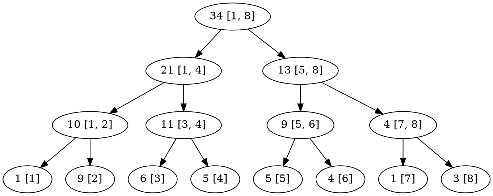

---

|           1           |           2            | 3                      | 4                      | 5                      |           6            | 7   |  8  |
|:---------------------:|:----------------------:| ---------------------- | ---------------------- | ---------------------- |:----------------------:| --- |:---:|
| 1 $\rightarrow$ ++6++ | 9 $\rightarrow$ ++14++ | 6 $\rightarrow$ ++11++ | 5 $\rightarrow$ ++10++ | 5 $\rightarrow$ ++10++ | 4 $\rightarrow$ ++9++ | 1   |  3  |

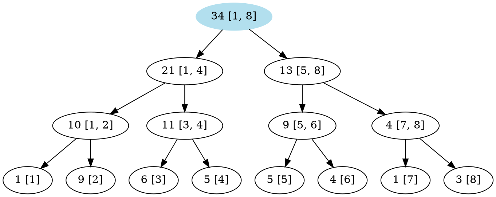

---

|           1           |           2            | 3                      | 4                      | 5                      |           6            | 7   |  8  |
|:---------------------:|:----------------------:| ---------------------- | ---------------------- | ---------------------- |:----------------------:| --- |:---:|
| 1 $\rightarrow$ ++6++ | 9 $\rightarrow$ ++14++ | 6 $\rightarrow$ ++11++ | 5 $\rightarrow$ ++10++ | 5 $\rightarrow$ ++10++ | 4 $\rightarrow$ ++9++ | 1   |  3  |

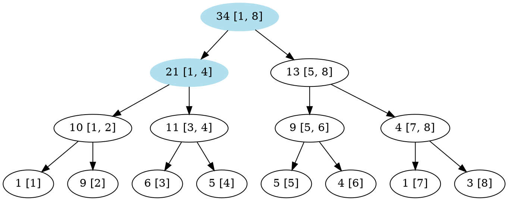

---

|           1           |           2            | 3                      | 4                      | 5                      |           6            | 7   |  8  |
|:---------------------:|:----------------------:| ---------------------- | ---------------------- | ---------------------- |:----------------------:| --- |:---:|
| 1 $\rightarrow$ ++6++ | 9 $\rightarrow$ ++14++ | 6 $\rightarrow$ ++11++ | 5 $\rightarrow$ ++10++ | 5 $\rightarrow$ ++10++ | 4 $\rightarrow$ ++9++ | 1   |  3  |

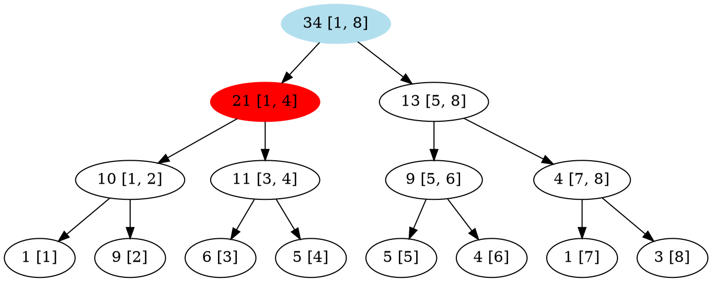

$[1, 4]$是$[1, 6]$的子集，因此將這個節點打上一個標記。
代表「這個區間的所有數字都要加$5$」。

---

|           1           |           2            | 3                      | 4                      | 5                      |           6            | 7   |  8  |
|:---------------------:|:----------------------:| ---------------------- | ---------------------- | ---------------------- |:----------------------:| --- |:---:|
| 1 $\rightarrow$ ++6++ | 9 $\rightarrow$ ++14++ | 6 $\rightarrow$ ++11++ | 5 $\rightarrow$ ++10++ | 5 $\rightarrow$ ++10++ | 4 $\rightarrow$ ++9++ | 1   |  3  |

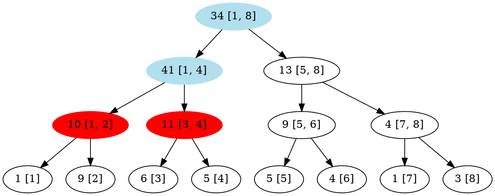

將懶惰標記往左、右子樹推，並且更新$[1, 4]$這個節點的值。
因為$[1, 4]$中有$4$個數字，每個數字都要加上$5$，因此總共要加上$20$。
所以這個節點的值就被更新成了$21 + 20 = 41$。

---

|           1           |           2            | 3                      | 4                      | 5                      |           6            | 7   |  8  |
|:---------------------:|:----------------------:| ---------------------- | ---------------------- | ---------------------- |:----------------------:| --- |:---:|
| 1 $\rightarrow$ ++6++ | 9 $\rightarrow$ ++14++ | 6 $\rightarrow$ ++11++ | 5 $\rightarrow$ ++10++ | 5 $\rightarrow$ ++10++ | 4 $\rightarrow$ ++9++ | 1   |  3  |

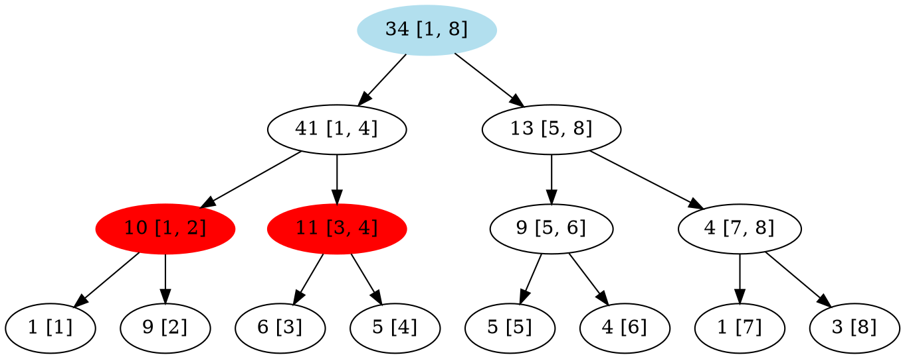

因為$[1, 4]$是$[1, 6]$的子集，因此不再向下遞迴。
打在$[1, 2]$、$[3, 4]$的標記暫時先放在那邊不管。

---

|           1           |           2            | 3                      | 4                      | 5                      |           6            | 7   |  8  |
|:---------------------:|:----------------------:| ---------------------- | ---------------------- | ---------------------- |:----------------------:| --- |:---:|
| 1 $\rightarrow$ ++6++ | 9 $\rightarrow$ ++14++ | 6 $\rightarrow$ ++11++ | 5 $\rightarrow$ ++10++ | 5 $\rightarrow$ ++10++ | 4 $\rightarrow$ ++9++ | 1   |  3  |

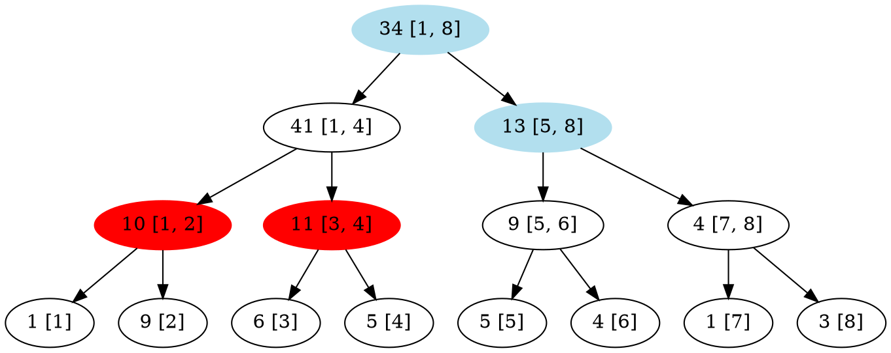

---

|           1           |           2            | 3                      | 4                      | 5                      |           6            | 7   |  8  |
|:---------------------:|:----------------------:| ---------------------- | ---------------------- | ---------------------- |:----------------------:| --- |:---:|
| 1 $\rightarrow$ ++6++ | 9 $\rightarrow$ ++14++ | 6 $\rightarrow$ ++11++ | 5 $\rightarrow$ ++10++ | 5 $\rightarrow$ ++10++ | 4 $\rightarrow$ ++9++ | 1   |  3  |

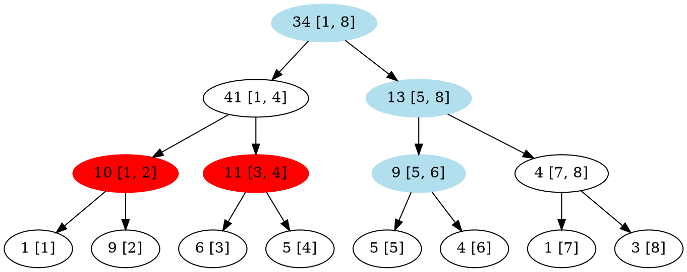

---

|           1           |           2            | 3                      | 4                      | 5                      |           6            | 7   |  8  |
|:---------------------:|:----------------------:| ---------------------- | ---------------------- | ---------------------- |:----------------------:| --- |:---:|
| 1 $\rightarrow$ ++6++ | 9 $\rightarrow$ ++14++ | 6 $\rightarrow$ ++11++ | 5 $\rightarrow$ ++10++ | 5 $\rightarrow$ ++10++ | 4 $\rightarrow$ ++9++ | 1   |  3  |

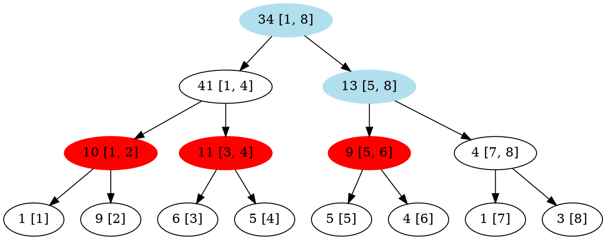

$[5, 6]$是$[1, 6]$的子集，因此將這個節點打上標記。
代表「這個區間內所有數字都要加$5$」。

---

|           1           |           2            | 3                      | 4                      | 5                      |           6            | 7   |  8  |
|:---------------------:|:----------------------:| ---------------------- | ---------------------- | ---------------------- |:----------------------:| --- |:---:|
| 1 $\rightarrow$ ++6++ | 9 $\rightarrow$ ++14++ | 6 $\rightarrow$ ++11++ | 5 $\rightarrow$ ++10++ | 5 $\rightarrow$ ++10++ | 4 $\rightarrow$ ++9++ | 1   |  3  |

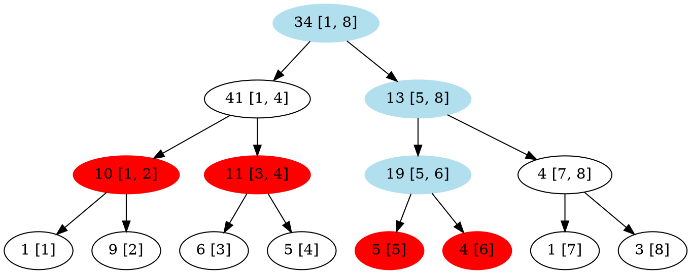

將懶惰標記往左、右子樹推，並且更新$[5, 6]$這個節點的值。
因為$[5, 6]$中有$2$個數字，每個數字都要加上$5$，因此總共要加上$10$。
所以這個節點的值就被更新成了$9 + 10 = 19$。

---

|           1           |           2            | 3                      | 4                      | 5                      |           6            | 7   |  8  |
|:---------------------:|:----------------------:| ---------------------- | ---------------------- | ---------------------- |:----------------------:| --- |:---:|
| 1 $\rightarrow$ ++6++ | 9 $\rightarrow$ ++14++ | 6 $\rightarrow$ ++11++ | 5 $\rightarrow$ ++10++ | 5 $\rightarrow$ ++10++ | 4 $\rightarrow$ ++9++ | 1   |  3  |

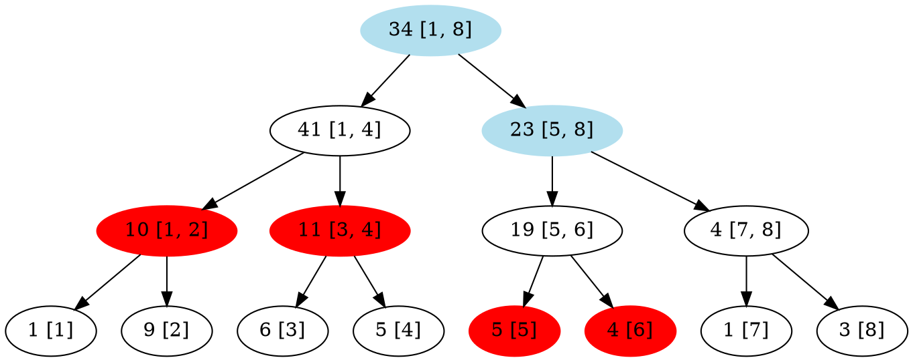

因為$[5, 6]$是$[1, 6]$的子集，因此不再向下遞迴。
打在$[5]$、$[6]$的標記暫時先放在那邊不管。

因為$[5, 6]$區間的值改變了，因此要更新$[5, 8]$區間的值。
和先前講過的更新方法一樣，改成左、右兩個子節點的值的和$19 + 4 = 23$即可。

---

|           1           |           2            | 3                      | 4                      | 5                      |           6            | 7   |  8  |
|:---------------------:|:----------------------:| ---------------------- | ---------------------- | ---------------------- |:----------------------:| --- |:---:|
| 1 $\rightarrow$ ++6++ | 9 $\rightarrow$ ++14++ | 6 $\rightarrow$ ++11++ | 5 $\rightarrow$ ++10++ | 5 $\rightarrow$ ++10++ | 4 $\rightarrow$ ++9++ | 1   |  3  |

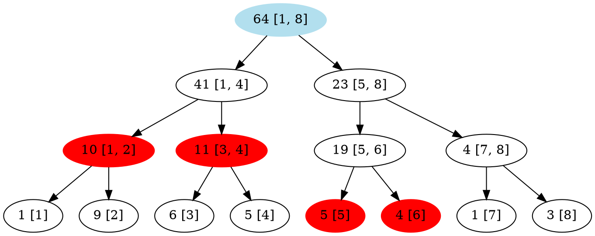

記得更新根節點的值，$41 + 23 = 64$。

---

### 查詢$a[4\cdots 8]$的和


---

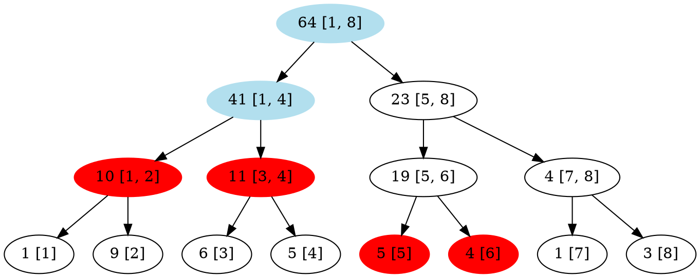

---

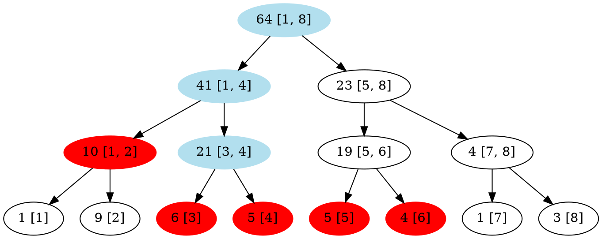

走到了$[3, 4]$這個節點的時候，發現它身上有著標記。
因此將這個標記往左、右子節點推，並且更新自身的值。
因為$[3, 4]$這個區間有兩個數字，因此要更新成$11 + 5 \times 2 = 21$。

---

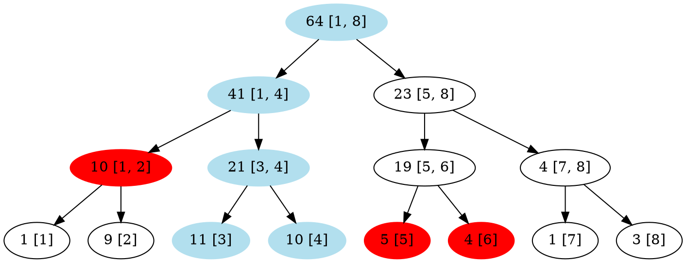

走到了$[4]$這個節點，其身上也有標記。
但因為已經是葉節點了，所以標記就不需要再往下推了。
而這個節點的值，則是更新成了$5 + 5 \times 1 = 10$。

又因為$[4]$是$[4, 8]$的子集，所以要回傳這個節點的值$10$回去。
（接下來用黃色代表那些節點的值被回傳了）

---

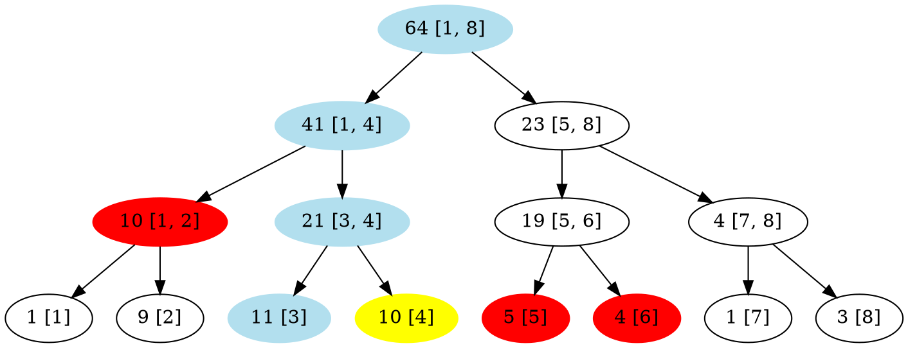

---

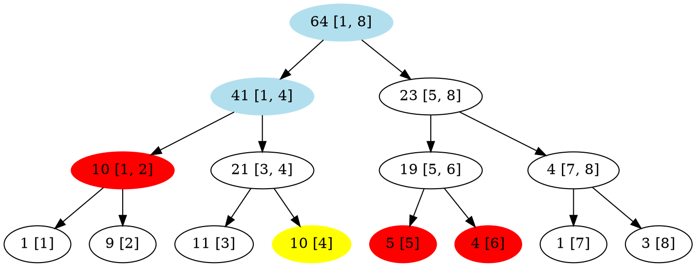

可以注意到：
這個節的值$41$並不等於左右節點上的值的和$10 + 21 = 31$。
然而，若是我們將左節點身上的懶標考慮進去的話，則$10 + 21 + 5 \times 2 = 41$。

---


---

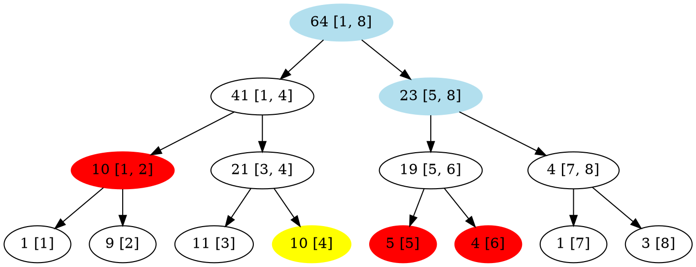

因為$[5, 8]$這個節點是$[4, 8]$的子集，所以回傳這個節點的值回去。

---

```graphviz
digraph{
    "64 [1, 8]" -> "41 [1, 4]"
    "64 [1, 8]" -> "23 [5, 8]"
    "41 [1, 4]" -> "10 [1, 2]"
    "41 [1, 4]" -> "21 [3, 4]"
    "23 [5, 8]" -> "19 [5, 6]"
    "23 [5, 8]" -> "4 [7, 8]"
    "10 [1, 2]" -> "1 [1]"
    "10 [1, 2]" -> "9 [2]"
    "21 [3, 4]" -> "11 [3]"
    "21 [3, 4]" -> "10 [4]"
    "19 [5, 6]" -> "5 [5]"
    "19 [5, 6]" -> "4 [6]"
    "4 [7, 8]" -> "1 [7]"
    "4 [7, 8]" -> "3 [8]"
    "64 [1, 8]" [color = "lightblue2", style = "filled"]
    "10 [1, 2]", "5 [5]", "4 [6]"[color = "red", style = "filled"]
    "10 [4]", "23 [5, 8]" [color = "yellow", style = "filled"]
}
```

最終，回傳回來的值加起來為$10 + 23 = 33$。
正是$a[4\cdots 8] = 10 + 10 + 9 + 1 + 3$的答案。

### 複雜度

實際上在上面例子中所打的標記，即是所謂的懶惰標記lazy tag。
其中心思想為：
$$
「先把標記打在節點上，等到未來走到這個節點的時候再將懶標往下推」
$$

不管是打上懶標、抑或是將懶標推到左右子樹。
因為都是在$modify$或$query$時「順便」做的。
因此懶標線段樹的複雜度和原本的線段樹一樣，修改、查詢$O(log(n))$。

### 程式碼

```cpp=
int seg[100000 * 4 + 9];
int tag[100000 * 4 + 9];

void push(int id, int l, int r) {
    seg[id] += tag[id] * (r - l + 1); // 更新節點的值
    if (l != r) { // 如果目前不是葉節點的話，則將懶標往左右子樹推
        tag[id * 2] += tag[id];
        tag[id * 2 + 1] += tag[id];
    }
    tag[id] = 0; // 清空當前節點的懶標
}

void modify(int id, int l, int r, int ql, int qr, int x) {
    push(id, l, r); // 路過時就順便將懶標往下推
    if (r < ql || qr < l) return;
    if (ql <= l && r <= qr) {
        tag[id] += x;
        push(id, l, r); // 打完懶標後馬上往下推
        return;
    }
    int mid = (l + r) / 2;
    modify(id * 2, l, mid, ql, qr, x);
    modify(id * 2 + 1, mid + 1, r, ql, qr, x);
    seg[id] = seg[id * 2] + seg[id * 2 + 1];
}

int query(int id, int l, int r, int ql, int qr) {
    push(id, l, r); // 路過時就順便將懶標往下推
    if (r < ql || qr < l) return 0;
    if (ql <= l && r <= qr) return seg[id];
    int mid = (l + r) / 2;
    return query(id * 2, l, mid, ql, qr) +
        query(id * 2 + 1, mid + 1, r, ql, qr);
}
```

## 總結

第一次接觸這些難免會心生怯意。
更進一步來說，這些只是基礎，困難的題目或許需要結合許多不同的演算法、資料結構才能夠解決。
但是，如果肯花時間去想題目、解題目，逐漸熟悉資訊競賽的思考方式的話，想必能夠看到不一樣的寬廣世界吧！