# 線段樹 Segment Tree

> 如果要我說在競賽程式中最重要的資料結構是甚麼，那麼我的答案是線段樹

## 概述

考慮以下問題：
給定一個長度為$n\leq 10^5$的數列$a_1, a_2,\cdots , a_n$，有$q \leq 10^5$個操作，分別為以下兩種：
1. 給定$L, R$，詢問$a_L + a_{L+1} + \cdots + a_{R}$的值
2. 給定$i, x$，將$a_i$的值更新成$a_i + x$

---

如果使用陣列來實作的話，第一個操作需要$O(n)$的時間、第二個則是$O(1)$，因此總複雜度是$O(nq)$，很明顯的不符合時間限制。

那麼，我們來看看以下的樹狀結構：

| 1   | 2   | 3   | 4   | 5   | 6   | 7   |  8  |
| --- | --- | --- | --- | --- | --- | --- |:---:|
| 1   | 9   | 6   | 5   | 5   | 4   | 1   |  3  |

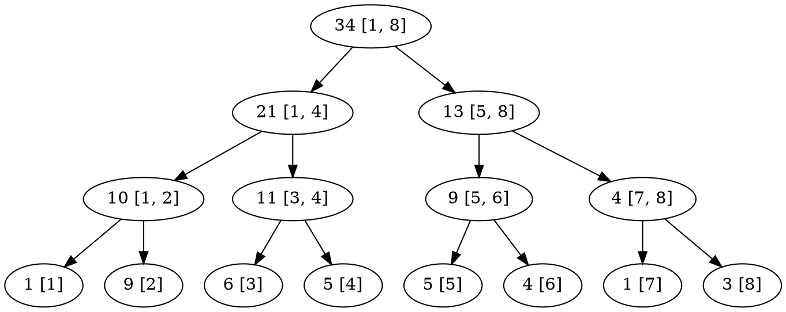

* 每個節點代表一個區間
左子節點代表左半區間
右子節點代表右半區間

---

* **求$[2, 6]$的值**

| 1   | 2   | 3   | 4   | 5   | 6   | 7   |  8  |
| --- | --- | --- | --- | --- | --- | --- |:---:|
| 1   | 9   | 6   | 5   | 5   | 4   | 1   |  3  |

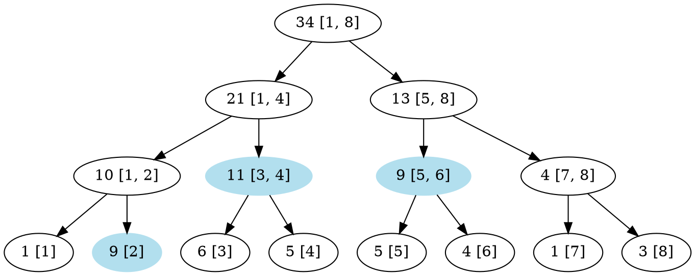

因為$[2, 6] = [2] + [3, 4] + [5, 6]$，所以我們可以將$[2, 6]$拆成三個較小的區間，因此：

$a_2+a_3+\cdots +a_6 = (a_2) + (a_3+a_4) + (a_5+a_6)$

而我們可以馬上知道：
1. $a_2 = 9$
2. $a_3 + a_4 = 11$
3. $a_5 + a_6 = 9$

因此，$a_2 + a_3 + \cdots + a_6 = 9 + 11 + 9 = 29$

--- 

* **求$[1, 3]$的值**

| 1   | 2   | 3   | 4   | 5   | 6   | 7   |  8  |
| --- | --- | --- | --- | --- | --- | --- |:---:|
| 1   | 9   | 6   | 5   | 5   | 4   | 1   |  3  |

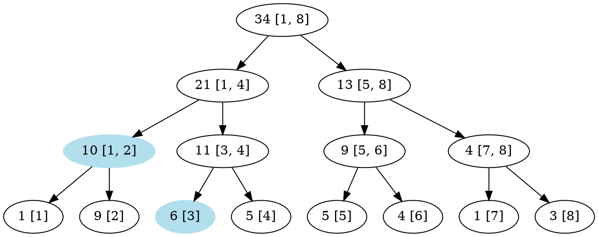

$a_1+a_2+a_3 = (a_1 + a_2) + (a_3)$
而我們可以馬上知道：
1. $a_1 + a_2 = 10$
2. $a_3 = 6$

因此，$a_1 + a_2 + a_3 = 10 + 6 = 16$

---

上述例子中的二元樹，每個節點分別存著一個線段的資訊，因此被稱作「線段樹」。

觀察一個二元樹的編號：

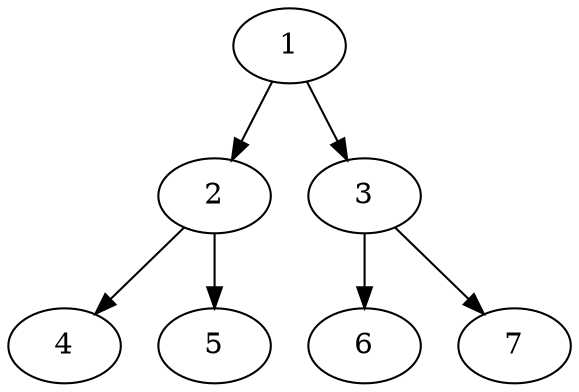

可以發現，對於任意節點$x$，左子節點會是$2x$、右子節點則是$2x+1$。
因此，我們可以使用一個陣列$seg$來表示線段樹。

---

## 宣告線段樹

```cpp=
const int N = 100000 + 9;
int seg[4 * N];
```

一棵維護$n$個數字的值的線段樹，至多會有$2^{\lceil log(n)\rceil}$個葉子、$2^{\lceil log(n)\rceil} - 1$個內部點。

因此，線段樹最多會有$2^{\lceil log(n)\rceil + 1} - 1$個點。

當$n = 2^k + 1$時，$\dfrac{2^{\lceil log(n)\rceil + 1} - 1}{n}$達到最大值，等於$4 - \dfrac{5}{n}$。

因此，陣列的大小需要開到$4n$。

---

## 建立線段樹

```cpp=
void bulid(int id, int l, int r) { // 編號為 id 的節點，存的區間為[l, r]
    if (l == r) {
        seg[id] = a[l]; // 葉節點的值
        return;
    }
    int mid = (l + r) / 2; // 將區間切成兩半
    build(id * 2, l, mid); // 左子節點
    build(id * 2 + 1, mid + 1, r); // 右子節點
    seg[id] = seg[id * 2] + seg[id * 2 + 1]
}
```
---

## 區間查詢

其實，查詢就只是在線段樹上進行$DFS$而已，並遵循以下規則：
1. 若目前的區間是詢問的區間的子集的話，則終止，並回傳當前節點的答案
2. 若目前的區間與詢問的區間的交集為空的話，則終止，並回傳$0$
3. 否則，往左、右進行遞迴

---

* **求$[1, 3]$的值**

| 1   | 2   | 3   | 4   | 5   | 6   | 7   |  8  |
| --- | --- | --- | --- | --- | --- | --- |:---:|
| 1   | 9   | 6   | 5   | 5   | 4   | 1   |  3  |

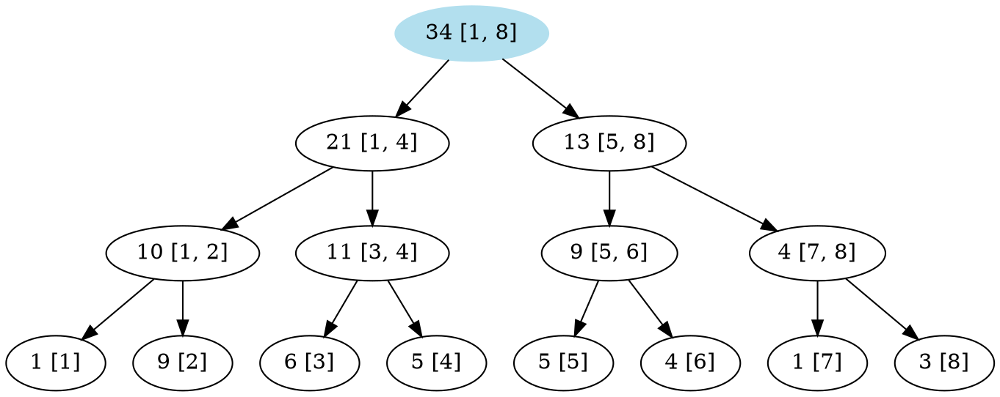

---

* **求$[1, 3]$的值**

| 1   | 2   | 3   | 4   | 5   | 6   | 7   |  8  |
| --- | --- | --- | --- | --- | --- | --- |:---:|
| 1   | 9   | 6   | 5   | 5   | 4   | 1   |  3  |

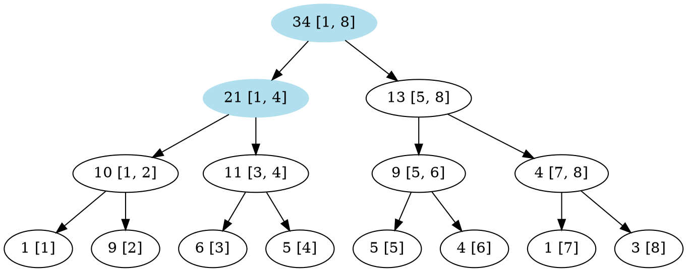

---

* **求$[1, 3]$的值**

| 1   | 2   | 3   | 4   | 5   | 6   | 7   |  8  |
| --- | --- | --- | --- | --- | --- | --- |:---:|
| 1   | 9   | 6   | 5   | 5   | 4   | 1   |  3  |

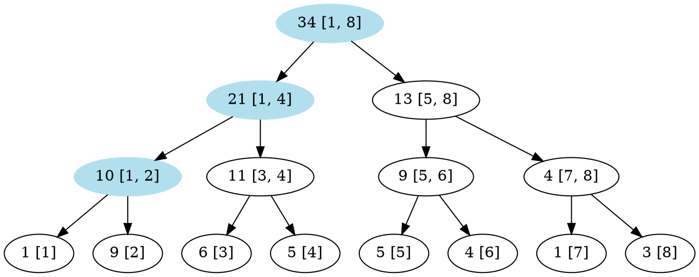

---

* **求$[1, 3]$的值**

| 1   | 2   | 3   | 4   | 5   | 6   | 7   |  8  |
| --- | --- | --- | --- | --- | --- | --- |:---:|
| 1   | 9   | 6   | 5   | 5   | 4   | 1   |  3  |

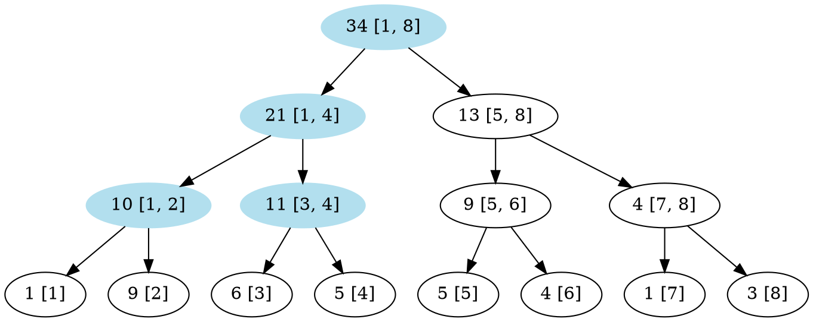

---

* **求$[1, 3]$的值**

| 1   | 2   | 3   | 4   | 5   | 6   | 7   |  8  |
| --- | --- | --- | --- | --- | --- | --- |:---:|
| 1   | 9   | 6   | 5   | 5   | 4   | 1   |  3  |

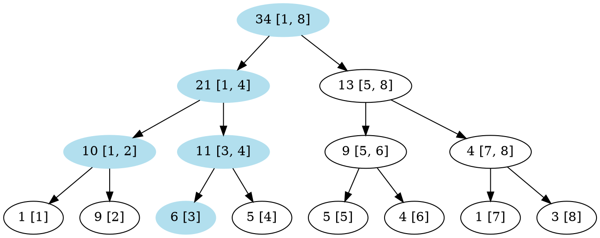

---

```cpp=
int query(int id, int l, int r, int ql, int qr) {
    if (r < ql || qr < l) return 0;
    if (ql <= l && r <= qr) return seg[id];
    int mid = (l + r) / 2;
    return query(id * 2, l, mid, ql, qr) 
        + query(id * 2 + 1, mid + 1, r, ql, qr);
}
```

---

## 單點修改

要修改一個數字的值的話，就只需要從葉節點往上，將所有經過的節點的值修改即可。
不過在實作上，是從根往下進行$DFS$的。

---

* **修改$a_5$為$10$**

| 1   | 2   | 3   | 4   |          5           | 6   | 7   |  8  |
| --- | --- | --- | --- |:--------------------:| --- | --- |:---:|
| 1   | 9   | 6   | 5   | 5$\rightarrow$++10++ | 4   | 1   |  3  |


---

* **修改$a_5$為$10$**

| 1   | 2   | 3   | 4   |          5           | 6   | 7   |  8  |
| --- | --- | --- | --- |:--------------------:| --- | --- |:---:|
| 1   | 9   | 6   | 5   | 5$\rightarrow$++10++ | 4   | 1   |  3  |

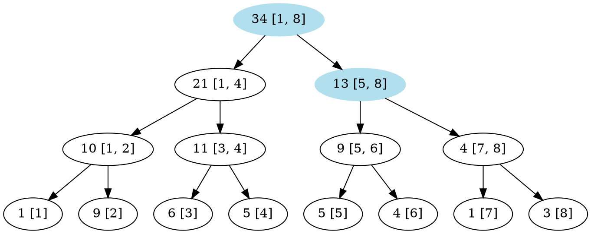

---

* **修改$a_5$為$10$**

| 1   | 2   | 3   | 4   |          5           | 6   | 7   |  8  |
| --- | --- | --- | --- |:--------------------:| --- | --- |:---:|
| 1   | 9   | 6   | 5   | 5$\rightarrow$++10++ | 4   | 1   |  3  |

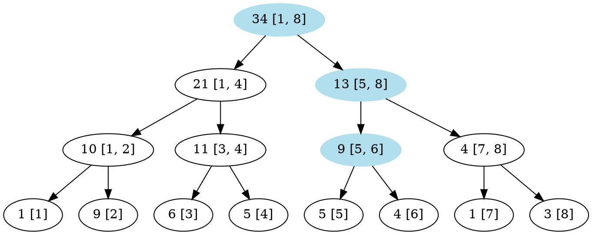

---

* **修改$a_5$為$10$**

| 1   | 2   | 3   | 4   |          5           | 6   | 7   |  8  |
| --- | --- | --- | --- |:--------------------:| --- | --- |:---:|
| 1   | 9   | 6   | 5   | 5$\rightarrow$++10++ | 4   | 1   |  3  |

* 將$[5]$修改成$10$

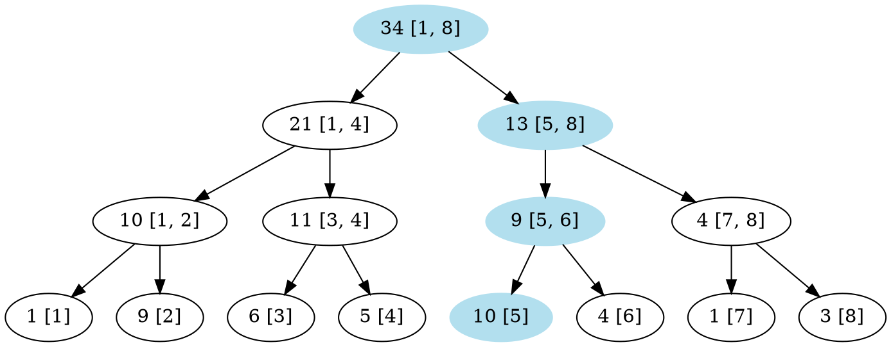

---

* **修改$a_5$為$10$**

| 1   | 2   | 3   | 4   |          5           | 6   | 7   |  8  |
| --- | --- | --- | --- |:--------------------:| --- | --- |:---:|
| 1   | 9   | 6   | 5   | 5$\rightarrow$++10++ | 4   | 1   |  3  |

* 將$[5, 6]$修改成$10 + 4 = 14$

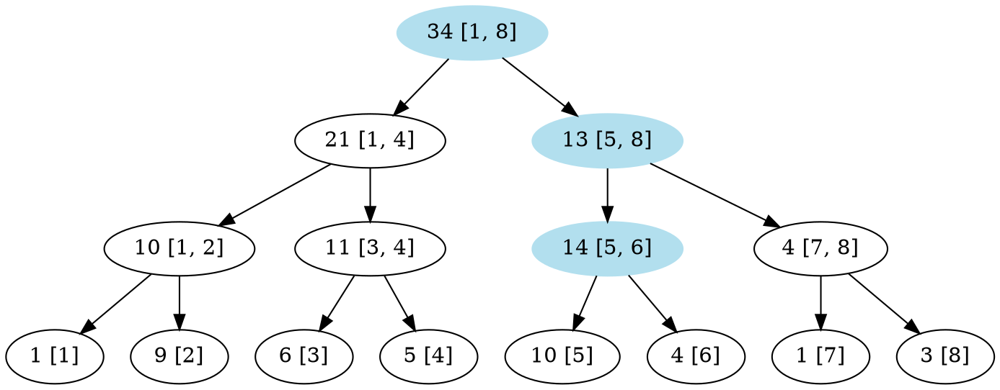

---

* **修改$a_5$為$10$**

| 1   | 2   | 3   | 4   |          5           | 6   | 7   |  8  |
| --- | --- | --- | --- |:--------------------:| --- | --- |:---:|
| 1   | 9   | 6   | 5   | 5$\rightarrow$++10++ | 4   | 1   |  3  |

* 將$[5, 8]$修改成$14 + 4 = 18$

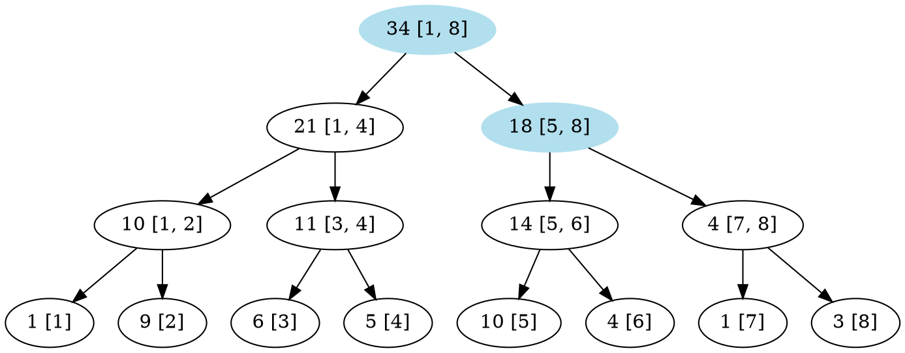

---

* **修改$a_5$為$10$**

| 1   | 2   | 3   | 4   |          5           | 6   | 7   |  8  |
| --- | --- | --- | --- |:--------------------:| --- | --- |:---:|
| 1   | 9   | 6   | 5   | 5$\rightarrow$++10++ | 4   | 1   |  3  |

* 將$[1, 8]$修改成$12+ 18 = 39$
    至此完成單點修改

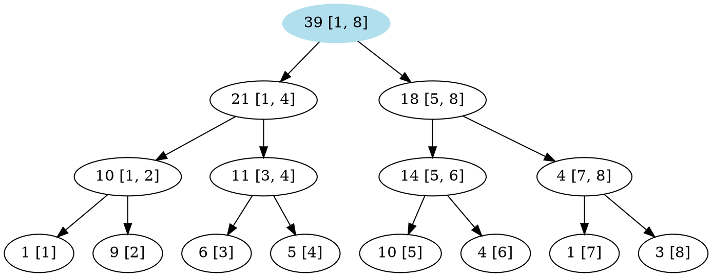

---

```cpp=
void modify(int id, int l, int r, int i, int x) {
    if (l == r) {
        seg[id] = x; // 將a[i]改成x
        //seg[id] += x; // 將a[i]加上x
        return;
    }
    int mid = (l + r) / 2;
    // 根據修改的點在哪裡，來決定要往哪個子樹進行DFS
    if (i <= mid) modify(id * 2, l, mid, i, x);
    else modify(id * 2 + 1, mid + 1, r, i, x);
    seg[id] = seg[id * 2] + seg[id * 2 + 1];
}
```

### 複雜度


| build  | modify      |    query    |
|:------:| ----------- |:-----------:|
| $O(n)$ | $O(log(n))$ | $O(log(n))$ |

一個區間最多只會被切成$O(log(n))$個線段樹上的區間。
但我們這邊並不會進行詳細的證明。

---

## 例題演練


### 單點改值、區間求最大值

給定一個長度為$n\leq 10^5$的數列$a_1, a_2,\cdots , a_n$，有$q \leq 10^5$個操作，分別為以下兩種：
1. 給定$L, R$，$\max(a_L, a_{L+1}, \cdots, a_{R})$的值
2. 給定$i, x$，$x\geq 0$，將$a_i$的值更新成$x$

---

這次的詢問是區間的最大值，因此節點上的資訊要存的是最大值。
要注意到的是，第二個操作變成了直接將$a_i$改成$x$，不過作法是類似的。


```cpp=
#include <bits/stdc++.h>
using namespace std;

int n;
int a[100000 + 9];
int seg[100000 * 4 + 9];
void build(int id, int l, int r) {
    if (l == r) {
        seg[id] = a[l];
        return;
    }
    int mid = (l + r) / 2;
    build(id * 2, l, mid);
    build(id * 2 + 1, mid + 1, r);
    seg[id] = max(seg[id * 2], seg[id * 2 + 1]);
}
void modify(int id, int l, int r, int i, int x) {
    if (l == r) {
        seg[id] = x;
        return;
    }
    int mid = (l + r) / 2;
    modify(id * 2, l, mid, i, x);
    modify(id * 2 + 1, mid + 1, r, i, x);
    seg[id] = max(seg[id * 2], seg[id * 2 + 1]);
}
int query(int id, int l, int r, int ql, int qr) {
    if (r < ql || qr < l) return 0;
    if (ql <= l && r <= qr) return seg[id];
    int mid = (l + r) / 2;
    return max(
        query(id * 2, l, mid, ql, qr),
        query(id * 2 + 1, mid + 1, r, ql, qr)
    );
}


int main() {
    cin >> n;
    for (int i = 1; i <= n; ++ i) cin >> a[i];
    build(1, 1, n);
    
    int q; cin >> q;
    while ( q -- ) {
        int op; cin >> op;
        if (op == 1) {
            int l, r;
            cin >> l >> r;
            cout << query(1, 1, n, l, r) << "\n";
        } else {
            int i, x;
            cin >> i >> x;
            modify(1, 1, n, i, x);
        }
    }
}
```

## 總結

如果一個區間的詢問，可以由許多獨立的小區間的答案組合而成的話。
那麼或許就可以使用線段樹。

另外，以上範例中所寫的線段樹是陣列型的。
除了這種的以外，還有指標型、偽指標型、動態開點．．．等等。
不過，只要熟悉了陣列型的線段樹的話，其他變形也能快速上手的吧。

線段樹對初學者來說常常是一道巨大的門檻。
每個人在一次一次寫的過程中都會摸索出自己最合適的寫法。
只要不畏懼，勇敢的面對題目的話，想必也能夠順利上手的吧。
