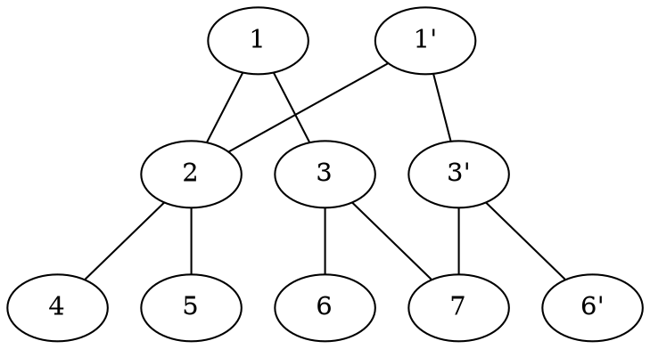

# 持久化資料結構

## 前言

持久化是一種相對於暴力來說，以較小代價來維護資料的歷史版本的技巧。
Git 就是一個典型的例子。
若單次修改影響到的資料不多的話，或許就能夠使用持久化的技巧。

* persistent 是能夠訪問、修改任意版本。
* partial persistent 是能夠訪問任意版本、但只能修改最新版本

相對的，一個帶有許多操作的問題，也可以輕易改造成持久化的問題。
舉例來說：
:::info
給定一個數列與 $Q$ 筆操作，操作分別為：
1. 將第 $k$ 個版本的數列中的第 $i$ 個數字改為 $x$
2. 求第 $k$ 個版本的數列第 $L\sim R$ 的數字加總

每次操作之後，都會產生一個新的版本，編號由 $1$ 開始。
:::
撇除版本，就是普通的線段樹問題；加了版本，就是持久化線段樹問題。
~~所以持久化就只是個假議題。~~

## 持久化線段樹

### 單點修改

每次修改的時候僅會動到 $O(\log{n})$ 個節點。

持久化的時候，新開 $O(\log{n})$ 個節點，其餘部分沿用上個版本。

因此需要使用指標型的線段樹。



### 區間修改

利用 lazy tag 可以將單次修改中會動到的節點數量壓在 $O(\log{n})$。

因此也可以使用持久化的技巧。

但要注意在推懶標的時候也得建立新的節點，而不能動到舊的節點上的資料。

## 持久化分塊

把數列切成 $\sqrt{n}$ 個一塊，修改、查詢都是 $O(\sqrt{n})$。

修改時改成建立新的一塊，並且用 linked-list 維護，再加上一點小細節。

## 持久化 DSU

:::info
給定 $n\le 10^5$ 個點與 $Q\le 10^5$ 個操作。
每個操作分別為加邊、刪邊、查圖上連通塊數量三者其一。
:::

[可持久化并查集](https://www.luogu.com.cn/problem/P3402)

:::info
給定 $n\le 10^5$ 個集合，第 $i$ 個集合內一開始只有 $i$。
有 $Q\le 10^5$ 個操作，操作分別為：
1. 將第 $k$ 個版本中 $a, b$ 所在集合合併
2. 問第 $k$ 個版本中 $a, b$ 是否在同一個集合中

以上兩個操作皆會產生一個新的版本，編號由 $1$ 開始。
:::

## 持久化 treap

merge、split 中每個 ```=``` 的運算都開一個新 node 給它。

## 小結

總結而言就是，對於每次的修改，都建立新的資料給它而非修改舊的資料。

並在這樣的過程中，設法維護住資料的結構。

## 例題

[Coding Days コーディングデイス](https://tioj.ck.tp.edu.tw/problems/1840)

:::info
給定數列 $S$，長度為 $n\le 10^5$。有 $Q\le 10^5$ 筆詢問。
每次給定 $L, R, k$，請問 $S[L\cdots R]$ 中第 $k$ 大的數字是多少。
* 帶修改
* 支援插入數字
* 支援複製序列中一段後插入
* 支援刪除序列中的一段
* 改成樹上的問題（有無修改）
:::

::: info
給定 $n\le 10^5$ 個點的樹。$Q\le 10^5$ 筆詢問。
每次問一個點向上到根的路徑上，第一個權重為 $x$ 的點是誰。
* 帶修改
:::

:::info
給定 $n$ 個簡單多邊形。$Q\le 10^5$ 筆詢問。
每筆詢問一個點掉在哪個多邊形中，若有多個選編號最小的。
保證所有多邊形的邊數加總 $\le 500$。
:::

:::info
給定數列 $a$，長度為 $n\le 10^5$。支援 $Q\le 10^5$ 筆操作：
1. 在數列尾新增一個數字。
2. 給定 $L,R,k$，問 $p\in[L, R]$ 時 $k\oplus\bigoplus_{i=p}^n a_i$ 的最大值是多少。
:::

:::info
給定字串 $S$，長度 $\le 10^5$。支援三種操作：
1. 插入一段字串（長度總和 $\le 10^5$）
2. 複製一段字串後插入
3. 詢問某個位置的值
:::

:::info
給定 $n\le 10^5$ 個點。支援 $Q\le 10^5$ 筆操作：
加點、刪點、詢問當前凸包。
保證詢問凸包操作中，需要回答的總點數 $\le 10^5$。
:::

:::info
給定數列 $a$，長度 $\le 10^5$。$Q\le 10^5$ 筆詢問。
每次問區間 $[L, R]$ 中平均最大的子數列的平均值是多少。
:::

## 持久化有向圖結構

* 假設每個節點上維護的資料量是 $O(1)$（$\Rightarrow deg=O(1)$）
* 有向邊是由 pointer 來進行維護。

1. Fat Node method：
    * access: $O(\log{m})$ time slowdown
    * modify: $O(1)$
3. Path copying method
    * access: $O(\log{m})$ extra time
    * modify: $O(n)$ time/space
4. Modification box method
    * access: $O(\log{m})$ extra time
    * modify: amortized $O(1)$


## 練習題

[Missing Coin Sum Queries](https://cses.fi/problemset/task/2184/)
:::info
給定長度為 $n\le 2\times 10^5$ 的數列 $S$，$1\le s_i\le 10^9$。
有 $Q\le 2\times 10^5$ 筆詢問，詢問 $S[L\cdots R]$ 中最小無法被湊出來的數字是多少。
:::

[Movie Festival Queries](https://cses.fi/problemset/task/1737/)
:::info
給定 $n\le 2\times 10^5$ 個電影的開始、結束時間 $1\le a_i, b_i\le 10^6$。
有 $Q\le 2\times 10^5$ 筆詢問，給定 $1\le L, R\le 10^6$，求這段時間內可以看多少電影。
:::

[Computer Cache](https://codeforces.com/gym/102433)

:::info
給定一個長度為 $n\le 5\times 10^5$ 的主陣列，一開始都是 $0$。
給定 $m\le 5\times 10^5$ 個副陣列 $x_i$（$\sum |x_i| \le 5\times 10^5$）。
共有 $Q\le 5\times 10^5$ 筆操作，每筆操作為以下三種之一：
1. 將 $x_k$ 從主陣列的第 $i$ 個位置填入，保證不會出界
2. 求主陣列第 $p$ 個位置的值
3. 將 $x_i$ 的 $l\sim r$ 的位置加一
:::